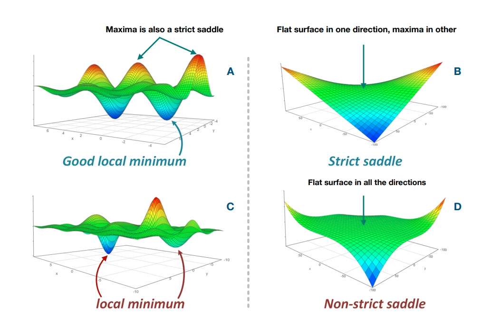

\newpage


# Introduction:

\doublespacing

Well-control optimization (also known as production optimization) can be defined as making the best decision for a set of control variables in continuous space, given a pre-defined objective function. The objective function generally relies on a reservoir simulator to evaluate the proposed control variable for the period of the reservoir life cycle[^1]. On the other hand, the decision alternatives are usually well injection/production rates or bottom-hole pressure (BHPs) in continuous space, subject to a set of constraints. Given the objective function and alternatives, uncertainties are represented by a set of geological realizations (i.e., an ensemble). Known, as Robust Optimization (RO), within RO, the objective is to find a control vector to maximize the expected value of the objective function over geological uncertainty. In contrast, in the deterministic case, the source of uncertainty in the geological model is ignored. Well-control optimization typically poses challenges as the objective function is non-linear and non-convex [@debrito2020]. Moreover, the optimization problem becomes computationally demanding in the RO setting, where many geological models must be considered to represent the uncertainty. This renders the optimization problem computationally expensive, if not prohibitive, in large-scale systems where (potentially) hundreds of wells are involved.

[^1]: In the case of Closed-loop Reservoir Management, we may not perform one optimization for the reservoir life-cycle. The optimization process is broken down into multiple steps, where data assimilation is performed between each cycle. Even in that case, the well-control optimization should be done from the start to the first stage of the data assimilation step. This cycle continues until the end of the field. Say the field has a life-cycle of 20 years; optimization can be done every five years.

Literature of well-control optimization can be viewed from two angles. First, the focus is on the type (category) of the optimization algorithm. Broadly speaking, the type of optimization algorithm could be divided into two categories, gradient-based and gradient-free.

@vanessen2009 optimized hydrocarbon production under geological uncertainty (in RO setting), where an adjoint-based method is used for obtaining the gradient information. The adjoint-based procedure is more efficient because it uses gradients that are constructed efficiently from the underlying simulator. However, the adjoint-based method requires access to the source code of the reservoir simulator, which is seldom available for commercial simulators, and is computationally intensive. @chen2009 introduced the ensemble-based optimization method (EnOpt), in which the gradient is approximated by the covariance between the objective function values and the control variables. @do2013 analyzed the theoretical connections between EnOpt and other approximate gradient-based optimization methods. Having realized that it is unnecessary to approximate the ensemble mean to the sample mean as was done by @chen2009, @do2013 used the ensemble mean in their EnOpt formulation. @stordal2016 had a theoretical look at EnOpt formulation and showed that EnOpt is a special case of well-defined natural evolution strategy known as Gaussian Mutation. It is a special case from this perspective that EnOpt is Gaussian Mutation without the evolution of covariance matrix $(\sum)$ of multivariate Gaussian density.

On the other hand, gradient-free methods represent a useful alternative when the exact computation of gradient is not available or is too expensive to compute. The gradient-free methods can be divided into two major classes, stochastic and pattern search. Both of these classes do not need access to the source code of the simulator or approximation of the gradient. However, they are usually less efficient and require a larger number of function evaluations than adjoint-gradient methods.

Probably the first use of the gradient-free method for subsurface application, @harding1998 applied genetic algorithm (GA) to production scheduling of linked oil and gas fields. A Comparison study was performed, and they showed the GA outperforms simulated annealing (SA) and sequential quadratic programming (SQP) techniques and a hybrid of the two. GA was utilized later by @almeida2007 for the optimization of control valves in the intelligent wells. They found that significant profit was achieved in comparison to using conventional methods (no valve control). More recently, @lushpeev2018 applied Particle Swarm Optimization (PSO) to a real field case to find optimum injection mode for the mature field. Control variables were the change in injection rates of 3 injectors, and results of field experiments show the improvement in relative recovery after applying the modified solution of the optimization algorithm.[@torczon1997]

Generalized Pattern-search (GPS) methods [@torczon1997] are another types of gradient-free techniques has been applied in well control optimization problem. The pattern-search method relies on polling; a stencil is centered at the current solution at any particular iteration. The stencil comprises a set of directions such that at least one is a descent direction. If some of the points in the stencil represent an improvement in the objective function, the stencil is moved to one of these new solutions. GPS, including its variant (Mesh Adaptive Direct Search), is usually considered a local search method. However due to its ability to parallelize, it has been well used in the literature of well control optimization. [@echeverríaciaurri2010; @asadollahi2014; @foroud2016; @nwachukwu2018]. To overcome the locality of the GPS methods, a hybrid of the PSO as global method and then using pattern search for local search in iterative (PSO-MADS) way as well proposed in the work of [@isebor2013; @debrito2020].

## Survey of surrogate-based papers in Onepetro database

In the previous section, we reviewed two major categories (gradient-based and gradient-free) for well control optimization. However, it should be noted that even with a more computationally efficient optimization method like EnOpt, still performing full RO optimization with full physic reservoir simulators is computationally prohibitive [@hong2017]. We will discuss the detail of this computational burden more in Section \@ref(problem-statement). In order to make RO feasible, two general approaches have been introduced. The first set of techniques targets the flow problem. These methods include capacitance-resistance models [@hong2017; @yousef2006; @zhao2015], deep-learning, machine learning surrogates [@kim2021; @nwachukwu2018; @kim2020; @chai2021] and reduced-physics simulations [@debrito2020; @nasir2021; @møyner2014]. These methods generally entail approximating the high-fidelity flow simulation model with a lower-fidelity or reduced order model, or a model-based on simplified flow physics. To get insight into how this line of research is evolving, we performed a small text mining task. Mining the more than 100000 peer-reviewed papers published in (www.onepetro.org), we count the number of the papers with "one" of the following keywords in their abstract:

1.  "Proxy" + " Optimization" + "Reservoir"
2.  "Surrogate" + "Optimization" + " Reservoir"
3.  "Reduced-physics model" + "Optimization" + " Reservoir"

The period of 1995-2020 was considered. As Figure \@ref(fig:onepetroanalysis) reveals, we see that around ten years ago in this research area we had around \~ 10 papers per year, now that number is around three times more. Part of this interest in developing a "physic-reduced model" could be attributed to development in machine learning research and transferring knowledge for building data-driven models for subsurface applications.

\begin{figure}

{\centering \includegraphics[width=468px]{0_Paper1_main_files/figure-latex/onepetroanalysis-1} 

}

\caption{Counting the number of papers with the keyword in their abstract vs. year}(\#fig:onepetroanalysis)
\end{figure}

In this work, we propose Bayesian Optimization (BO) as a workflow for well control optimization in Ro setting. We will show that BO, as a gradient-free method, has characteristics of the global optimization method in escaping local optima or saddle area. While, at the same time, the workflow overcomes the typical downside of gradient-free methods, which is need for many function evaluations. Due to utilizing the probabilistic model to mimic the expensive objective function, BO workflow is inherently efficient, meaning that a minimum number of function evaluations is needed to achieve a near-optimum solution. To validate this idea, we compared the BO with two other gradient-free, global optimization techniques (PSO, GA). The result shows that BO reaches similar (same) solutions while using only 20% of function evaluations, compared to the other two algorithms. We would like to refer to the results of the "OLYMPUS Optimization Benchmark Challenge" [@fonseca2020] where the gradient-free methods showed the best performance in achieving the highest NPV. However, participants mentioned the pain of these methods as they carry huge computational burden due to large function evaluation [@silva2020; @pinto2020; @chang2020]. In light of benchmark results, bringing the computational efficiency to the gradient-free optimization category is a significant contribution, presented in this work.

In section 2 ("Problem Statement"), we will describe the underlying problem in well control optimization and the need for efficient optimization to deal with the enormous computational burden of optimization. In section 3 ("Bayesian Optimization Workflow"), we will lay out the mathematical background of the BO workflow. In section 4, "Case I: 1-D Toy Problem", BO workflow is tested on 1-D problem where we guide our audience with a step-by-step process about how to apply BO. In Section 5, "Case II: Field Scale Problem" BO is applied to a 3-D synthetic geological model for optimizing injection scheme in eight injectors. In section 6, "Comparison with other Alternatives", a comparison of the BO with two global optimization techniques, PSO and GA in field case is presented. The paper ends with "Conclusion" in section 7.

<!-- -   small function value f(x) with least search cost there are two conflicting objectives -->

<!-- -   Global Optimiation [\^1] -->

<!-- While developing a field, prediction of reservoir response to change in the variable is an am important factor to have an efficient reservoir management. The field of reservoir engineering is rich in the development and application of full-physics numerical simulations for forward modeling. However, the computational power needed to run such numerical simulators most of the time is huge. Especially, the framework of the Robust Optimization where uncertainty are considered through multiple of geological realization (thousand or multi-thousand), the practical applicability of such forward modeling is considerably limited. To address this challenge, the proxy-modeling for reservoir managemnet has emerged to reduce the cost of forward simulation. The root of this field goes back to the work of the [@bruce1943] where the analogy between flow of electricty in tthorugh te electrical device and the response of the reservoir was constructed. [@albertoni2003] Proposed the a Multivariate Linear Regression (MLR) to estimate the production from the well, where it claimed that total production at each is linear combination of injection rates with diffusitivity filter. Building on the work of [@albertoni2003], [@yousef2006] proposed a new procedure to quantify communication between wells, where for each injector/producer pair, two coefficients, capacitance to quantify connectivity and time constant to quantify the degree of fluid storage were considered. [@sayarpour2008] used superposition in time to analytically solve the numerical integration in CRM. [@zhao2015](Zhao et al. 2015) articulated that CRM models are not applicable when production rates change significantly, mainly due to those models neglect to include intearction of production-production and injector-injector pair well. Formulating the model in the framework titled INSIM (interwell numerical simulation model), it was used as efficient replacement to reservoir simulator when history-matching phase rate data or water-cut data obtained during water flooding operations. -->

<!-- Seperatley, in sake of utilization of recent advancemnet in the world of Information technology, couple of reaserach has been don eon the development of "Surrogate Reservoir Models" - [@mohaghegh2006] proposed the workflow for SRM model where Fuzzy Paatern Recognition (FPR) technology was dimensionality reduction, in both static and dynamic parameters of the reservir . Key Performance Indicator (KPI) was used to select the most important variable.- [@sampaio2009] tried on use of feed-forward neural networks as nonlinear proxies of reservoir response. A few set of rock and fluid properties were considere a input (porosity, permeability in "x" direction, permeability in "y" direction, and rock compressibility) where in developing the neural network model, only one hidden layer was used. flow proxy modeling to replace full simulation in history matching, and built the proxy with a single hidden layer artificial neural network (ANN). To predict the oil production from the SAGD rocess, (Fedutenko et al. 2014) [@fedutenko2014]employed the RBF Neural Network to predict the cumulative oil production over the time horizon of production (10 years) . <!--#  -->


\newpage


# Problem Statement

In general, an optimization task can be defined as a search process for the maximum output value of a "well behaved" ^[In this context, it means the function is defined everywhere inside the input domain, It is single-valued and continuous.] objective function $\mathbf{J}$. Can be defined as $\mathbf{J}: \chi \rightarrow \mathbb{R}$ where acceptable solutions $\chi$ have a dimension of $D$, $\chi \subseteq \mathbb{R}^D$:


```{=tex}
\begin{equation}
\begin{aligned}
& \underset{\mathbf{u}}{\text{maximize}}
& & \mathbf{J}(\mathbf{u}) \\
& \text{subject to}
& & \mathbf{u} \subseteq \chi
\end{aligned}
\label{eq:globalopt}
\end{equation}
```


In the examples of this paper, the goal is to maximize the Net-Present-Value (NPV) in USD. Thus, the primary objective function is referred to as simply NPV in the rest of this paper. This objective function has been widely used in both well-control and field development optimization studies. In a deterministic setting, the uncertainty in the geological parameters is disregarded, and the optimization is performed based on a single geological model. Therefore, in the case of deterministic optimization, the objective function can be defined as:

```{=tex}
\begin{equation}
\mathbf{J}(\mathbf{u, G})= \sum_{k=1}^{K} \Bigg [\sum_{j=1}^{N_p}p_oq_{o,j,k}(\mathbf{u, G}) 
- \sum_{j=1}^{N_p}p_{wp}q_{wp,j,k}(\mathbf{u, G}) - 
\sum_{j=1}^{N_{wi}}p_{wi}q_{wi,j,k}(\mathbf{u, G}) \Bigg]\frac{\Delta t_k}{(1+b)^{\frac{t_k}{D}}}
\label{eq:npvdet}
\end{equation}
```

The first term in the double summation corresponds to the oil revenue; the second term is water-production cost, and the third term corresponds to the water injection cost. The Equation \@ref(eq:npvdet) is considered as the objective function for the deterministic setting since only a single geological model is considered. The $\mathbf{G}$ in Equation \@ref(eq:npvdet) is "the geological model". The additional parameters in the Equation are as follows: $K$ is the total number of timesteps; $N_p$ is the total number of production wells subject to optimization; $N_{wi}$ is the total number of water-injection wells subject to optimization; $k$ is the timestep index; $j$ is the well-number index; $p_o$ is the revenue from oil production per unit volume (in USD/bbl); $p_{wp}$ is the water-production cost per unit volume (in USD/bbl); $p_{wi}$ is the water-injection cost per unit volume (in USD/bbl); $q_o$ is the oil-production rate (in B/D); $q_{wp}$ is the water-production rate (in B/D); $q_{wi}$ is the water-injection rate (in B/D); $\Delta t_k$ is the time interval for timestep $k$ (in days); $b$ is the discount rate (dimensionless); $t_k$ is the cumulative time for discounting; and D is the reference time for discounting ($D = 365$ days, if b is expressed as a fraction per year and the cash flow, is discounted daily). $\mathbf{u}$ in Equation \@ref(eq:npvdet) is the control vector (i.e., a vector of control variables) defined as $\mathbf{u} = [u_1, u_2, \cdots, u_N]^D$, $D$ is the number of control variables (dimension of optimization problem).

As mentioned above, Equation \@ref(eq:npvdet) lacks to capture the uncertainty in the geological model. In contrast, in a Robust Optimization (RO) setting, the objective is to optimize the expected value over all geological realizations (assumption here is decision-maker is risk-neutral). Then, the goal is to optimize the $\mathbb{E}_{\mathbf{G}}[\mathbf{J}(\mathbf{u},\mathbf{G})]$, can be defined as:


```{=tex}
\begin{equation}
\mathbb{E}_{\mathbf{G}}[\mathbf{J}(\mathbf{u},\mathbf{G})]=\int_{\mathcal{Z}}\mathbf{J}(\mathbf{u, G})p(\mathbf{G})dG
\label{eq:npvopt-exact}
\end{equation}
```


Where $p(\mathbf{G})$ is probability density function (PDF) of the random variable, $\mathbf{G}$, and $\mathcal{Z}$ is the domain of the values $\mathbf{G}$ can take^[Let us say permeability is the uncertain variable, then it only takes $z \in \mathcal{Z},z>0$]  . However, throughout , we assume that the uncertainty in $\mathbf{G}$ can be represented by sampling its PDF ($p(\mathbf{G})$) to obtain an ensemble of $n_e$ realization, $\mathbf{G}_{re}$, $re=1,2,\cdots,n_e$. Therefore, approximation of $\mathbb{E}_{\mathbf{G}}[\mathbf{J}(\mathbf{u},\mathbf{G})]$ can be written as:

```{=tex}
\begin{equation}
\mathbb{E}_{\mathbf{G}}[\mathbf{J}(\mathbf{u},\mathbf{G})]\approx\overline{\mathbf{J}}(\mathbf{u})=\frac{\sum_{re=1}^{n_e} \mathbf{J}(\mathbf{u,G_{re}})}{n_e}
\label{eq:npvopt}
\end{equation}
```

Where in Equation \@ref(eq:npvopt) contrary to Equation \@ref(eq:npvdet), there is not one, rather $n_e$ geological realizations, each of them written as $\mathbf{G_{re}}$. Also, note that we dropped the dependency of $\overline{\mathbf{J}}$ on $\mathbf{G}$ and wrote the objective function as  $\overline{\mathbf{J}}(\mathbf{u})$. This is because the $n_e$ number of $\mathbf{G_{re}}$ is fixed at the start, and in all optimization process, we use the same $\mathbf{G_{re}}$. In this work, the objective is to optimize $\overline{\mathbf{J}}(\mathbf{u})$ in Equation \@ref(eq:npvopt), where it is simply an approximation of the expected value of NPV defined in \@ref(eq:npvdet) over all realizations.^[In the rest of the paper, we use "Expected NPV" or $\overline{\mathbf{J}}(\mathbf{u})$ interchangeably, but we note that they are the same.] 

However, we would like to elaborate that optimization of $\overline{\mathbf{J}}(\mathbf{u})$ needs special treatment due to three main difficulties. Therefore, the optimization method should be able to handle them, to manage the optimization of Equation \@ref(eq:npvopt). The three difficulties are: 

-   Analytic expression of $\overline{\mathbf{J}}(\mathbf{u})$ is explicitly unknown. In order to compute, $\overline{\mathbf{J}}(\mathbf{u})$, we need to find $\mathbf{J}(\mathbf{u, G})$ in Equation \@ref(eq:npvdet). Here, inside Equation \@ref(eq:npvdet), dependency of $q_{o,j,k}(\mathbf{u, G}),q_{wp,j,k}(\mathbf{u, G}),q_{wi,j,k}(\mathbf{u, G})$ on $(\mathbf{u, G})$ is explicit. In other words, we do not have access^[There is indeed a function $f$, but in flow simulation, due to iterative solving of large PDE equations (mainly inside the commercial simulators), we can not track and write down the analytical expression of $f$. To put it simply, there is a $f$ available, but we do not have access to that.] to an analytical function $f$ so that we can write $q_{wi,j,k}(\mathbf{u, G})=f(\mathbf{u, G})$. The main implication of lack of access to the analytical expression of $f$ is that the objective function prohibit us from being able to use gradient-based (as we need $f$, in order calculate $\frac{\partial f}{\partial \mathbf{u}}$) methods. Alternatively, someone can resort to an approximation of $\frac{\partial f}{\partial \mathbf{u}}$ or $\frac{\partial \overline{\mathbf{J}}(\mathbf{u})}{\partial \mathbf{u}}$ in general, but that requires careful and consistent attention on how to approximate.   
-   The surface of $\overline{\mathbf{J}}(\mathbf{u})$ is multi-modal. Meaning $\overline{\mathbf{J}}(\mathbf{u})$ is non-convex in the domain of $\chi$ , and the optimization algorithm must visit all local optima to find the "global" one.^[Someone may argue that in well-control optimization, although non-convex, the difference between local optima and global optima is low. Therefore even reaching local optima is enough. That may be true in some special cases, but from the theoretical point of view, the $\overline{\mathbf{J}}(\mathbf{u})$ does not meet Jensen's inequality ($\overline{\mathbf{J}}[\lambda \mathbf{\mathbf{u_1}}+(1-\lambda)\mathbf{u_2}]\leq \lambda\overline{\mathbf{J}}(\mathbf{\mathbf{u_1}}) + (1-\lambda)\overline{\mathbf{J}}(\mathbf{\mathbf{u_2}})$ for any $\mathbf{u_1}$,$\mathbf{u_2}$ and any $\lambda$ where $0<\lambda<1$). Therefore, the optimization is classified as non-convex optimization.]
-   Most notably, forward evaluation of $\overline{\mathbf{J}}(\mathbf{u})$ is computationally expensive. This point will be discussed more in detail below.

It is well defined in the literature that optimizing $\overline{\mathbf{J}}(\mathbf{u})$ is computationally prohibitive [@debrito2021; @nwachukwu2018; @hong2017]. Let us assume a simple case to illustrate the computational burden of this optimization problem. Assume that an E&P enterprise is in the process of finding the injection rate of five injection wells and bottom hole pressure (BHP) of five other production wells($D=10$) for the next five years. It means we have to make a decision, where the decision alternatives have a dimension of ten, and each dimension is in continuous space. The geology team of the enterprise came up with 100 geological realizations of the model.($n_e=100$). Now, if we suppose that the reservoir model is 3D, a rich grid-based, it is not hard to imagine that flow-simulation of the reservoir model will take \~1hr, to compute $q_{o,j,k}(\mathbf{u, G}),q_{wp,j,k}(\mathbf{u, G}),q_{wi,j,k}(\mathbf{u, G})$. Then, simply having 100 realizations means that each forward computation of $\overline{\mathbf{J}}(\mathbf{u})$ takes around \~100 hr. Considering that the enterprise has to decide in a six-month period (in the best case, it can be interpreted as six months CPU running time), the total number of the available computational resource for running the forward model $\frac{6 \times 30 \times 24 }{100}= 43.2 \approx 50$ is around 50. Having of the only $50$ forward model evaluations in ten-dimensional, non-linear, and non-convex optimization problem is relatively low. To put this in simple terms, if we say that each dimension of the control variable $\mathbf{u}$ could be discretized into ten possible cases, then the total available decision alternatives (solutions) for this optimization problem will be: $\text {Number of all possible alternatives} = 10^{10}$. As it is clear, finding the best solution from a pool of ten billion possible solutions with only 50 shots is a pretty much hard undertaking.\

In the rest of this paper, we will be discussing that the Bayesian Optimization workflow presented here is well suited to deal with the three difficulties described above. 

<!-- It is well defined in the literature that optimizing Equation \@ref(eq:npvopt) is computationally prohibitive [@debrito2021; @nwachukwu2018; @hong2017]. Not only because thousand(s) of PDE have to be solved simultaneously in the flow-simulation in order to compute the $q_o, q_{wp}, q_{wi}$; the flow simulation must be enumerated over all realizations $n_e$ to compute $\overline{J}(u)$. Let us assume a simple case to illustrate the computational burden of this optimization problem. Assume that an E&P enterprise is in the process of finding the injection rate of five injection wells and bottom hole pressure (BHP) of other five production wells, $D=10$. The geology team of the enterprise comes up with 100 geological realizations of the model.($n_e=100$). Now, if we suppose that the reservoir model is 3D with a moderate number of grid cells, it is not hard to imagine that flow-simulation of a fine grid model will take \~1hr. Then, simply having 100 realizations means that each forward computation of $\overline{J}(u)$ takes around \~100 hr. Considering that the enterprise has to decide in six month period (in the best case, it can be interpreted as six months CPU running time), which means that the total number of the available budget for running the forward model is$\frac{6 \times 30 \times 24 }{100}= 43.2 \approx 50$ is around 50. The budget of the only $50$ forward model in ten-dimensional, non-linear, and non-convex optimization problem is relatively low. To put this in simple terms, if we say that each dimension of the control variable $\mathbf{u}$, could be discretized into ten possible cases, then total available decision alternatives (solutions) for this optimization problem will be $\text {Number of all possible alternatives} = 10^{10}$. As it is clear, finding the best solution from a pool of ten billion possible solutions with only 50 shots is a pretty much hard undertaking.\ -->

<!-- In the rest of this paper, we will be discussing that the Bayesian Optimization workflow is well suited to deal with the three difficulties described at the beginning of the section.  -->


<!-- In Figure \@ref(fig:optglobal) we can see some examples where the surface of $\mathbf{J}$ could be challenging to be optimized. The surfaces on the left side need careful attention to avoid getting stuck in local optima. Figures on the right side show presence of saddle area, where the gradient of function $\mathbf{J}$ is zero, in some cases in only one direction, possibly all directions. In this work, the focus is on the type of objective function $\mathbf{J}$, which is challenging to optimize because of the following three difficulties: -->

<!-- -   Analytic expression of $\mathbf{J}$ is explicitly unknown. This is a typical case in reservoir optimization problems where the Net Present Value (NPV) or Recovery Factor (RF) is computed through solving a vast number of partial differential equations through flow simulation. Thus, a precise analytical expression for the objective function is not available, avoiding the applicability of techniques that exploit the analytical expression of the objective function. -->
<!-- -   The surface of $\mathbf{J}$ is multi-modal. Meaning that $\mathbf{J}$ is non-convex in the domain of $\chi$ , and the optimization algorithm must visit all local optima to find the "global" one. -->
<!-- -   Most importantly, forward evaluation of $\mathbf{J}$ is computationally expensive. This point will be discussed more in detail below. -->


<!-- ```{r optglobal, echo=FALSE, fig.cap="This plot may change, it does not show what exactly I want to say...", out.width="70%", fig.align='center'} -->
<!--  -->
<!-- ``` -->

<!-- In the examples of this paper, the goal is to maximize the Net-Present-Value (NPV), in USD. Thus, the primary objective function referred to as simply NPV in the rest of this paper. This objective function has been widely used in both well control and field development optimization studies. In a deterministic setting, the uncertainty in the geological parameters is disregarded and the optimization is performed based on a single geological model. Therefore, in the case of deterministic optimization, the objective function can be defined as: -->

<!-- ```{=tex} -->
<!-- \begin{equation} -->
<!-- \mathbf{J}(\mathbf{u, G})= \sum_{k=1}^{K} \Bigg [\sum_{j=1}^{N_p}p_oq_{o,j,k}(\mathbf{u, G})  -->
<!-- - \sum_{j=1}^{N_p}p_{wp}q_{wp,j,k}(\mathbf{u, G}) -  -->
<!-- \sum_{j=1}^{N_{wi}}p_{wi}q_{wi,j,k}(\mathbf{u, G}) \Bigg]\frac{\Delta t_k}{(1+b)^{\frac{t_k}{D}}} -->
<!-- \label{eq:npvdet} -->
<!-- \end{equation} -->
<!-- ``` -->

<!-- Where the first term in the double summation corresponds to the oil revenue; the second term is water-production cost and third term corresponds to the water-injection cost. Equation \@ref(eq:npvdet) is considered as objective function in the deterministic setting since only a single geological model is considered. The $G$ in the Equation \@ref(eq:npvdet) is "the geological model". The additional parameters in the Equation are as follows: $K$ is the total number of timesteps; $N_p$ is the total number of production wells subject to optimization; $N_{wi}$ is the total number of water-injection wells subject to optimization; $k$ is the timestep index; $j$ is the well-number index; $p_o$ is the revenue from oil production per unit volume (in USD/bbl); $p_{wp}$ is the water-production cost per unit volume (in USD/bbl); $p_{wi}$ is the water-injection cost per unit volume (in USD/bbl); $q_o$ is the oil-production rate (in B/D); $q_{wp}$ is the water-production rate (in B/D); $q_{wi}$ is the water-injection rate (in B/D); $\Delta t_k$ is the time interval for timestep $k$ (in days); $b$ is the discount rate (dimensionless); $t_k$ is the cumulative time for discounting; and D is the reference time for discounting ($D = 365$ days if b is expressed as a fraction per year and the cash flow is discounted daily). $\mathbf{u}$ in Equation \@ref(eq:npvdet) is the control vector (i.e., a vector of control variables) defined as $\mathbf{u} = [u_1, u_2, \cdots, u_N]^D$, where $D$ is the number of control variables (dimension of optimization problem). -->

<!-- As mentioned above, Equation \@ref(eq:npvdet) lacks to capture the uncertainty in the geological model. In contrast, in a Robust Optimization (RO) setting, the objective is to optimize the expected value over all geological realizations (assumption here is decision maker is risk-neutral). Then, the gaol is to optimize the $\mathbb{E}_{\mathbf{G}}[\mathbf{J}(\mathbf{u},\mathbf{G})]$, can be defined as: -->


<!-- ```{=tex} -->
<!-- \begin{equation} -->
<!-- \mathbb{E}_{\mathbf{G}}[\mathbf{J}(\mathbf{u},\mathbf{G})]=\int_{-\infty}^{+\infty}\mathbf{J}(\mathbf{u, G})p(\mathbf{G})dG -->
<!-- \label{eq:npvopt-exact} -->
<!-- \end{equation} -->
<!-- ``` -->


<!-- Where $p(\mathbf{G})$ is probability density function (PDF) of random variable, $\mathbf{G}$. However, thoroughout , we assume that the uncertainity in $\mathbf{G}$ can be represented by sampling its PDF ($p(\mathbf{G})$) to obtain an ensemble of $n_e$ realization, $\mathbf{G}_{re}$, $re=1,2,\cdots,n_e$. Therefore, approximation of $\mathbb{E}_{\mathbf{G}}[\mathbf{J}(\mathbf{u},\mathbf{G})]$ can be written as: -->

<!-- ```{=tex} -->
<!-- \begin{equation} -->
<!-- \mathbb{E}_{\mathbf{G}}[\mathbf{J}(\mathbf{u},\mathbf{G})]\approx\overline{J}(\mathbf{u})=\frac{\sum_{re=1}^{n_e} J(\mathbf{u,G_{re}})}{n_e} -->
<!-- \label{eq:npvopt} -->
<!-- \end{equation} -->
<!-- ``` -->

<!-- Where in Equation \@ref(eq:npvopt) contrary to Equation \@ref(eq:npvdet), there is not one, rather $n_e$ geological realizations, each of them written as $G_{re}$. In this work, the objective is to optimize the Equation \@ref(eq:npvopt), where it is simply approximation of expected value of NPV defined in \@ref(eq:npvdet) over all realizations. -->

<!-- It is well defined in the literature that optimizing Equation \@ref(eq:npvopt) is computationally prohibitive [@debrito2021; @nwachukwu2018; @hong2017]. Not only because thousand(s) of PDE have to be solved simultaneously in the flow-simulation in order to compute the $q_o, q_{wp}, q_{wi}$; the flow simulation must be enumerated over all realizations $n_e$ to compute $\overline{J}(u)$. Let us assume a simple case to illustrate the computational burden of this optimization problem. Assume that an E&P enterprise is in the process of finding the injection rate of five injection wells and bottom hole pressure (BHP) of other five production wells, $D=10$. The geology team of the enterprise comes up with 100 geological realizations of the model.($n_e=100$). Now, if we suppose that the reservoir model is 3D with a moderate number of grid cells, it is not hard to imagine that flow-simulation of a fine grid model will take \~1hr. Then, simply having 100 realizations means that each forward computation of $\overline{J}(u)$ takes around \~100 hr. Considering that the enterprise has to decide in six month period (in the best case, it can be interpreted as six months CPU running time), which means that the total number of the available budget for running the forward model is$\frac{6 \times 30 \times 24 }{100}= 43.2 \approx 50$ is around 50. The budget of the only $50$ forward model in ten-dimensional, non-linear, and non-convex optimization problem is relatively low. To put this in simple terms, if we say that each dimension of the control variable $\mathbf{u}$, could be discretized into ten possible cases, then total available decision alternatives (solutions) for this optimization problem will be $\text {Number of all possible alternatives} = 10^{10}$. As it is clear, finding the best solution from a pool of ten billion possible solutions with only 50 shots is a pretty much hard undertaking.\ -->

<!-- In the rest of this paper, we will be discussing that the Bayesian Optimization workflow is well suited to deal with the three difficulties described at the beginning of the section.  -->

\newpage


# Bayesian Optimization Workflow

## Overall View

Bayesian Optimization (BO) is an optimization method that builds a probabilistic model to mimic the expensive objection function, $\overline{\mathbf{J}}(\mathbf{u})$ in Equation \@ref(eq:npvopt). The probabilistic model is an inference from a finite number of function evaluations. This finite number of function evaluations is done as initialization of the workflow and building a probabilistic model.

After initializing and building a probabilistic model, a new query point ($\mathbf{u}^{new}$) is evaluated using the expensive objective function. Then the new data $(\mathbf{u}^{new},\mathbf{J}(\mathbf{u}^{new}))$ is assimilated back to the probabilistic model to update the model. The unique methodology of using a non-deterministic surrogate model makes Bayesian optimization (BO) an efficient global optimizer capable of exploring and exploiting space of decision.

In the rest of this section, the objective function is shown with $\overline{\mathbf{J}}(\mathbf{u})$, consistent with the Equation \@ref(eq:npvopt). However, for convention, we drop the bar and write the $\overline{\mathbf{J}}(\mathbf{u})$ with $\mathbf{J}(\mathbf{u})$. Moreover, $\mathbf{u}$ is a decision (control) variable, with a dimension of $D$, $\mathbf{u}=[u_1,\cdots,u_D]$. While the capital letter, $\mathbf{U}$ is a collection of $\mathbf{N}$ points of $\mathbf{u}$, defined as: $\mathbf{U}= [\mathbf{u_1},\cdots,\mathbf{u_N}]$.

The workflow of BO can be divided into two steps:

-   Step 1: Choose some initial design points $\mathcal{D}=\{{\mathbf{U},\mathbf{J(U)}}\}$ to build a probabilistic model inferred from $\mathcal{D}$
-   Step 2: Deciding on next $\mathbf{u}^{next}$ and evaluate $\mathbf{J(u^{next})}$ based on probabilistic model and $\mathcal{D}=\mathcal{D}\: \cup[\mathbf{u}^{next},\mathbf{J(u^{next})}]$

After step 2, we come back to step 1 with the new $\mathcal{D}$, and we iterate this process until we are out of computational resources. First, we will explain Gaussian Process Regression (GPR) to build a probabilistic model as a background for the workflow. Then, both steps are explained in detail.

## Gaussian Process

In this work, we employ the widely used Gaussian process Regression (GPR) as a probabilistic model. Known as a surrogate model (since it tries to mimic the real, expensive objective function), GPR is an attractive choice because it is computationally tractable with the capability to quantify the uncertainty of interest [@rasmussen2006; @murphy2022]. A Gaussian Process (GP) can be seen as an extension of the Gaussian distribution to the functional space. The key assumption in (GP) is that: the function values at a set of $M > 0$ inputs, $\mathbf{J} = [\mathbf{J({u_1})}, ...,\mathbf{J(u_M)}]$, is jointly Gaussian, with mean and covariance defined as:

```{=tex}
\begin{equation}
  \begin{split}
&\mathbb{E} \: [\mathbf{J(u_i)}]= m(\mathbf{u_i})=  [m(\mathbf{u_1}),\cdots,m(\mathbf{u_M})] \\
& \text{Cov} \: [\mathbf{J(u_i)},\mathbf{J(u_j)}]= \mathbf{K} \\
& \mathbf{i,j}=1,\cdots,\mathbf{M}
  \end{split}
\label{eq:mean-cov}
\end{equation}
```


In Equation \@ref(eq:mean-cov), $m(\mathbf{u_i})$ is a mean function and $\mathbf{K}$ is a covariance matrix. The *Gram* matrix, $\mathbf{K}$, is ${M \times M}$ matrix, where at each element $\mathbf{i,j}$, its is defined by covariance function, $\kappa(\mathbf{u_i},\mathbf{u_j})$. It can be seen that, $\kappa(\mathbf{u_i},\mathbf{u_j})$ specifies the similarity between two values of a function evaluated on $\mathbf{u_i}$, and $\mathbf{u_j}$.


```{=tex}
\begin{align}
  \begin{split}
\mathbf{K}: \: & \:   \mathbf{K}_\mathbf{{ij}}=\kappa(\mathbf{u_i},\mathbf{u_j}), \\
 = & \:  \left (
\begin{array}{ccc}
\begin{array}{l}
\kappa(\mathbf{u_1},\mathbf{u_2})
\end{array}
& \cdots & 
\begin{array}{l}
\kappa(\mathbf{u_1},\mathbf{u_M})
\end{array} \\
\vdots & \ddots & \vdots\\
\begin{array}{l}
\kappa(\mathbf{u_N},\mathbf{u_1})
\end{array} &
\cdots & 
\begin{array}{l}
\kappa(\mathbf{u_N},\mathbf{u_M})
\end{array} 
\end{array}
\right )
  \end{split}
\label{eq:post-mean-cov-single-k}
\end{align}
```


The GP is defined as distribution over any finite number of M point, completely defined by its mean vector and covariance matrix,

```{=tex}
\begin{equation}
[\mathbf{J(u_1)},\cdots,\mathbf{J(u_M)}] \sim \mathcal{N}_M(m(\mathbf{u_i}), \mathbf{K}))
\label{eq:mean_cov_gp}
\end{equation}
```

For $i=1,\cdots,M$. Where $\mathcal{N}_M$ denotes a Multivariate Normal Distribution (MVN), with dimension of $M$. As discussed in [@shahriari2016], there are many choices for the covariance function; $\kappa(\mathbf{u_i},\mathbf{u_j})$, the most commonly used ones in the literature have been depicted in Table \@ref(tab:cov-tab).


Where in the Table \@ref(tab:cov-tab), $\ell$ is length-scale, and $h$ is eludian distance of $\mathbf{u_i}$, $\mathbf{u_j}$. ( Note that $|h|^2=(\mathbf{u_i}-\mathbf{u_j})^\intercal(\mathbf{u_i}-\mathbf{u_j})$). In this work, the Matern covariance function with $\nu=\frac{5}{2}$ was employed.  However, depending on any choice of covariance function, the covariance function parameters need to be estimated. These parameters can be denoted as $\theta$ as:

```{=tex}
\begin{equation}
\theta = [\sigma^2_{f},\ell]
\label{eq:cova-theta}
\end{equation}
```

The parameter $\theta$ needs to be optimized, as it will be explained later section \@ref(hyper-param). With this background, BO workflow is explained as follows.

### Step 1: Choose some initial design points $\mathcal{D}=\{{\mathbf{U},\mathbf{J(U)}}\}$ to build a probabilistic model inferred from $\mathcal{D}$

Assuming we start GPR with a finite number of an initial evaluation of $\mathbf{J(u)}$ on the points in $\mathbf{U}$, we can define the data-set $\mathcal{D}$ as:

```{=tex}
\begin{align}
  \begin{split}
\mathbf{U}= & \: [\mathbf{u_1},\cdots,\mathbf{u_N}] \\
\mathbf{J_U}= & \: [\mathbf{J(u_1)},\cdots,\mathbf{J(u_N)}] \\
\mathcal{D}= & \: \{\mathbf{U},\mathbf{\mathbf{J_U}}\}
  \end{split}
\label{eq:init-data}
\end{align}
```

Now we consider the case of predicting the outputs for a new inputs that are not in $\mathcal{D}$. Lets say we want find $\mathbf{J(u)}$ at $\mathbf{u_*}$(looking at $\mathcal{D}$, we can say  $\mathbf{u_{N+1}}=\mathbf{u_*}$). In mathematical term, we want to find PDF function $\mathbf{J(u)}$ at point $\mathbf{u_*}$, given the $\mathbf{J_U}$, can be defined as $p(\mathbf{J_{u_*}}|\mathbf{J_U})$. Through the rule of probability, we can write as:


<!-- Specifically, we want to predict probability density function of function outputs $\mathbf{J_{U_*}} = [\mathbf{J(u_1)},\cdots, \mathbf{J(u_{N_*})}]$ given a test set (prediction set) set $\mathbf{U_*}$ of size $\mathbf{N_* \times D}$.  -->


```{=tex}
\begin{equation}
p(\mathbf{J_{u_*}}|\mathbf{J_U})=\frac{p(\mathbf{J_{u_*}},\mathbf{J_U})}{p(\mathbf{J_U})}
\label{eq:cond-prob}
\end{equation}
```

```{=text}
\begin{equation}

\end{equation}
```


Where per definition of Gaussian Process, any combination of $\mathbf{J(u_1)},\cdots,\mathbf{J(u_N)}$, is MVN, we can write numerator of above Equation as:

```{=tex}
\begin{equation}
p(\mathbf{J_{u_*}},\mathbf{J_U}|\theta^*)=\mathcal{N}_{N+1}\begin{pmatrix}
\begin{bmatrix}
\mathbf{J_{u_*}} \\ \mathbf{J_{U}}  
\end{bmatrix} \Bigg|
\begin{bmatrix} m(\mathbf{u_*}) \\ m(\mathbf{U})   \end{bmatrix},\begin{bmatrix} \mathbf{\kappa}_{u_\ast,u_\ast} &  \mathbf{K}_{U,u_\ast} \\
\mathbf{K}^\intercal_{U,u_\ast} & \mathbf{K}_{U,U}
\end{bmatrix} \\
\end{pmatrix}
\label{eq:joint-prob}
\end{equation}
```


Note that in left side of above Equation, we introdced the term $\theta^*$. $p(\mathbf{J_{u_*}},\mathbf{J_U}|\theta^*)$ means that the term on right side of equation is dependentnd on $\theta^*$ value, implicit in covarinca matrices. $\theta^*$ is defined as "optimial hyper-parameter" of covariance function, where the procedure to estimate is showed in the next section. $\mathbf{\kappa}_{u_\ast,u_\ast}$ simply means $\mathbf{\kappa}({u_\ast,u_\ast})=\sigma^2_{f}$, also  $\mathbf{K}_{U,u_\ast}$ is $N\times1$, $\mathbf{K}_{U,U}$ is $N\times N$ matrices. In same way, we can write MVN for ${p(\mathbf{J_{U}})}$. Inserting Equation \@ref(eq:joint-prob) into Equation \@ref(eq:cond-prob) we have:

```{=tex}
\begin{equation}
p(\mathbf{J_{u_*}}|\mathbf{J_{U}},\theta^*)=\frac{\mathcal{N}_{n+1}\begin{pmatrix}
\begin{bmatrix}
\mathbf{J_{u_*}} \\ \mathbf{J_{U}}  
\end{bmatrix} \Bigg|
\begin{bmatrix} m(\mathbf{u_*}) \\ m(\mathbf{U})   \end{bmatrix},\begin{bmatrix} \mathbf{\kappa}_{u_\ast,u_\ast} &  \mathbf{K}_{U,u_\ast} \\
\mathbf{K}^\intercal_{U,u_\ast} & \mathbf{K}_{U,U}
\end{bmatrix} \\
\end{pmatrix}}{\mathcal{N}_{n}\begin{pmatrix}\mathbf{J_{U}}\Bigg|
m(\mathbf{U}), \mathbf{K}_{U,U} \\
\end{pmatrix}}
\label{eq:cond-prob-long}
\end{equation}
```
<!-- $$p(\mathbf{J_{u_*}}|\mathbf{J_{U}})=\frac{\mathcal{N}_{n+1}\begin{pmatrix} -->
<!-- \begin{bmatrix} -->
<!-- \mathbf{J_{u_*}} \\ \mathbf{J_{U}}   -->
<!-- \end{bmatrix} \Bigg| -->
<!-- 0,\begin{bmatrix} \mathbf{\kappa}_{u_\ast,u_\ast} &  \mathbf{K}_{U,u_\ast} \\ -->
<!-- \mathbf{K}^\intercal_{U,u_\ast} & \mathbf{K}_{U,U} -->
<!-- \end{bmatrix} \\ -->
<!-- \end{pmatrix}}{\mathcal{N}_{n}\begin{pmatrix}\mathbf{J_{U}}\Bigg| -->
<!-- 0, \mathbf{K}_{U,U} \\ -->
<!-- \end{pmatrix}}$$ -->

Now, we can see that both numerator and denominator of \@ref(eq:cond-prob-long) can be written in exponential term (per definition of MVN). Then, after some tedious manipulation (provided in Appendix I), the final conditional probability has a closed form as:

```{=tex}
\begin{align}
  \begin{split}
p(\mathbf{J_{u_*}}|\mathbf{J_{U}},\theta^\ast)= & \:  \mathcal{N}_{1}(\mathbf{J_{u_*}}| \mathbf{\mu_{u_\ast}}, \mathbf{\sigma^2_{u_{\ast}}}) \\
\mathbf{\mu_{u_\ast}}= & \:  m(\mathbf{u_\ast}) +\mathbf{K}^\intercal_{U,u_*} \mathbf{K}^{-1}_{U,U}(\mathbf{J_U}-m(\mathbf{U})) \\
\textstyle \sigma^2_{\mathbf{u_{\ast}}}=& \:  \normalsize{\mathbf{\kappa}_{u_\ast,u_\ast}-\mathbf{K}^\intercal_{U,u_\ast}\mathbf{K}_{U,U}^{-1}\mathbf{K}_{U,u_\ast}}
  \end{split}
\label{eq:post-mean-cov-single}
\end{align}
```

In Equation \@ref(eq:post-mean-cov-single), we see that PDF of function at point $\mathbf{u_*}$ has a univariate normal distribution with the defined mean and variance.^[The $m(.)$ function that appears in mean term of Equation \@ref(eq:post-mean-cov-single),  is prior knowledge about mean value of $\mathbf{J(u)}$, defined as $m(\mathbf{U})=[m(\mathbf{u_1}),\cdots,m(\mathbf{u_N})]$. For simplicity someone can normalize the dataset and assume the prior mean function to be zero: $m(\mathbf{u_*})=m(\mathbf{U}) = 0$. This assumption is not restrictive because as more training points are observed the prior is updated and becomes more informative. In this work, we considered the case where the mean function could have a linear trend in the form of:$m(\mathbf{u}) = \sum_{j=1}^p \beta_j \mathbf{u}$, well known to Ordinary Krigging (OK) in Geostatistics community.]

To compute the right side of Equation \@ref(eq:post-mean-cov-single), we have all the components defined, except the the "optimum hyper-parameter", $\theta^*$. The next section we will explain the procedure to find $\theta^*$. 

#### Hyper-parameter Estimation of Covariance Funnction{#hyper-param}

As shown in Table \@ref(tab:cov-tab), the Matern covariance function with $\nu=\frac{5}{2}$ has two parameters to be estimated, namely $\sigma^2_f$ and $\ell$. GP is fit to the data by optimizing the evidence-the marginal probability of the data given the model with respect to the marginalized kernel parameters. Known as the empirical Bayes approach, we will maximize the marginal likelihood:

```{=tex}
\begin{equation}
p(\mathbf{y}|\mathbf{J_U,\mathbf{\theta}})= \int p(\mathbf{y}|\mathbf{J_U})p(\mathbf{J_U}|\mathbf{\theta})d\mathbf{J}
\label{eq:marg-like-int}
\end{equation}
```

The term $p(\mathbf{y}|\mathbf{J_U,\mathbf{\theta}})$ represents the probability of observing the data $y$ given on the model, $\mathbf{J_U,\mathbf{\theta}}$. The reason it is called the marginal likelihood, rather than just likelihood, is because we have marginalized out the latent Gaussian vector $\mathbf{J_U}$. Given that in this work, $p(\mathbf{y}|\mathbf{J_U})=1$^[Since here we are considering a "noise-free" observation], then right side of Equation \@ref(eq:marg-like-int) is simply $\mathcal{N}(m(\mathbf{U}),\mathbf{K}_{U,U})$, then taking $log$ of it can be written as:

```{=tex}
\begin{equation}
\text{log} \: p(\mathbf{y}|\mathbf{J_U,\mathbf{\theta}})=\mathcal{L}(\sigma_f^2,\ell)=-\frac{1}{2}(\mathbf{y}-m(\mathbf{U}))^{\intercal}\mathbf{K}_{U,U}^{-1}(\mathbf{y}-m(\mathbf{U}))-\frac{1}{2}\text{log}|\mathbf{K}_{U,U}|-\frac{N}{2}log(2\pi)
\label{eq:log-like}
\end{equation}
```

Where the dependence of the $\mathbf{K}_{U,U}$ on $\theta$ is implicit. This objective function (the right side of Equation \@ref(eq:log-like)) consists of a model fit and a complexity penalty term that results in an automatic Occam's razor for realizable functions (Rasmussen and Ghahramani, 2001). By optimizing the evidence with respect to the kernel hyperparameters, we effectively learn the structure of the space of functional relationships between the inputs and the targets. The gradient-based optimizer is performed in order to:

```{=tex}
\begin{equation}
\theta^{\ast}=[\sigma_f^{2\ast}, \ell^{\ast}]=argmax \: \mathcal{L}(\sigma^2_f,\ell)
\label{eq:log-like-opt}
\end{equation}
```

However, since the objective $\mathcal{L}$ is not convex, local minima can be a problem, so we need to use multiple restarts.

It is useful to note that the value $\theta^{\ast}$ could be estimated using only "initial data", $\mathcal{D}=[\mathbf{U},\mathbf{J_U}]$. Therefore, Equation \@ref(eq:post-mean-cov-single) has been written using the "optimized" value of $\theta$. 


### Step.2 Deciding on next $\mathbf{u}^{next}$ based on the probabilistic model{#nextpoint}

The posterior of the probabilistic model given by Equation \@ref(eq:post-mean-cov-single) can quantify the uncertainty of $\mathbf{J}$ over the any new $\mathbf{u_*}$. The question is, what is the next $\mathbf{u}^{next}$ to feed into the *expensive function*?. In other words, so far we have $\mathcal{D}$, but need to decide the next $\mathbf{u}^{next}$ so that going back to Step 1, our updated $\mathcal{D}$ be $\mathcal{D}=\mathcal{D} \: \cup[\mathbf{u^{next}},\mathbf{J(u^{next})}]$. One could select the next point arbitrarily, but that would be wasteful.

To answer this question, we define a utility function, and the next query point is the point with maximum utility. The literature of BO has seen many utility functions (called acquisition function in the computer science community). These include the Improvement based policies (Probability of Improvement (PI), Expected Improvement(EI)), optimistic policies (Upper Confidence Bound (UCB)), or Information-based (like Thompson Sampling (TS)). The full review of these utility functions and their strength and weakness could be reviewed in [@shahriari2016].

In the Expected Improvement (EI) policy, the utility is defined as follows:

```{=tex}
\begin{equation}
utility(\mathbf{u_\ast};\theta^{\ast},\mathcal{D})=\alpha_{EI}(\mathbf{u_\ast};\theta^\ast,\mathcal{D})=\int_{y}^{}max(0,\mathbf{J_{u_*}}-\mathbf{J})p(\mathbf{J_{u_*}}|\mathbf{\mathcal{D},\theta^\ast}) \,dy
\label{eq:utiint}
\end{equation}
```

The utility defined in Equation \@ref(eq:utiint) can be seen as the expected value of improvement in posterior of the model (Equation \@ref(eq:post-mean-cov-single)) compared to the *true function* at point $\mathbf{u_\ast}$. Note that the term $p(\mathbf{J_{u_*}}|\mathbf{\mathcal{D},\theta^\ast})$ inside the integral already has been defined at Equation \@ref(eq:post-mean-cov-single). However, we do not have access to the *expensive function*, $\mathbf{J}$; therefore, we replace the $\mathbf{J}$ with the best available solution found so far, $\mathbf{J}^+$. The $\mathbf{J^+}$ mathematically can be defined simply as below, then Equation \@ref(eq:utiint) can be written as Equation \@ref(eq:utiint2):

```{=tex}
\begin{equation}
\begin{aligned}
\mathbf{J^+} = \; \underset{\mathbf{u} \subseteq \mathcal{D}}{\text{max}}
\; \mathbf{J(u)}
\end{aligned}
\label{eq:j-plus}
\end{equation}
```

```{=tex}
\begin{equation}
\alpha_{EI}(\mathbf{u_\ast};\theta^\ast,\mathcal{D})=\int_{y}^{}max(0,\mathbf{J_{u_*}}-\mathbf{J^+})p(\mathbf{J_{u_*}}|\mathbf{\mathcal{D},\theta^\ast}) \,dy
\label{eq:utiint2}
\end{equation}
```

After applying some tedious integration by parts on the right side of \@ref(eq:utiint2), one can express the expected improvement in a closed-form [@jones1998]. To achieve closed form, first, we need some parametrization and define the $\gamma(\mathbf{u_*})$ as below:

```{=tex}
\begin{equation}
\gamma(\mathbf{u_*})=\frac{\mathbf{\mu_{u_\ast}}-\mathbf{J^+}}{\sigma_\mathbf{u_{\ast}}}
\label{eq:gamma}
\end{equation}
```

Where $\mathbf{\mu_{u_\ast}}$ and $\sigma_\mathbf{u_{\ast}}$ can be found from Eqaution \@ref(eq:post-mean-cov-single) and $\mathbf{J^+}$ has been defined in Equation \@ref(eq:j-plus). Given the $\gamma(\mathbf{u_*})$, the right side of Equation \@ref(eq:utiint2) can be written as:

```{=tex}
\begin{equation}
\alpha_{EI}(\mathbf{u_*};\theta^*,\mathcal{D})=(\mathbf{\mu_{u_\ast}}-\mathbf{J^+})\Phi(\gamma(\mathbf{u
_*})) + \sigma_{\mathbf{u_{\ast}}} \phi(\gamma(\mathbf{u_*}))
\label{eq:utility}
\end{equation}
```

Where $\Phi(.)$ and $\phi(.)$ are CDF and PDF of standard Gaussian distribution. We need to note that $\alpha_{EI}(\mathbf{u_*};\theta^*,\mathcal{D})$ is always non-negative, as the integral defined in \@ref(eq:utiint2) is truncating the negative side of the function $\mathbf{J}$ inside the $max()$ term. The Equation\@ref(eq:utility) does a fine job in many applications of Bayesian Optimization. However, the utility defined in Equation \@ref(eq:utility) sometimes can be *greedy*. In this context, greedy utility means that it is focused more on the "immediate reward", which is the first part of Equation \@ref(eq:utility), less on the "Exploration" part. Therefore to avoid this greed and make the utility function more forward-looking, an explorative term is added as $\epsilon$, and Equation \@ref(eq:gamma) can be re-written as:

```{=tex}
\begin{equation}
\gamma(\mathbf{u_*})=\frac{\mathbf{\mu_{u_\ast}}-\mathbf{J^+}-\epsilon}{\sigma^2_{\mathbf{u_{\ast}}}}
\label{eq:gamma-no-greed}
\end{equation}
```

Likewise, Expected improvement (EI) at point $\mathbf{u_*}$ can be defined then as:

```{=tex}
\begin{equation}
\alpha_{EI}(\mathbf{u_*};\theta,\mathcal{D})=(\mathbf{\mu_{u_\ast}}-\mathbf{J^+}-\epsilon)\Phi(\gamma(\mathbf{u
_*})) + \sigma_{\mathbf{u_{\ast}}} \phi(\gamma(\mathbf{u_*}))
\label{eq:utility-no-greed}
\end{equation}
```


In this work, the utility defined in Equation \@ref(eq:utility-no-greed) was considered. The data $\mathcal{D}$ was normalized to the scale of $[0,1]$. Given that scaling, $\epsilon=0.1$ was used in this work. At the end, the answer to the question of the next query is the point where the utility is maximum, can be defined as:

```{=tex}
\begin{equation}
\mathbf{u}_*^{next}=\underset{\mathbf{u_*} \in \mathbf{U_*} }{\mathrm{argmax}} \; \alpha_{EI}(\mathbf{u_*};\theta,\mathcal{D})
\label{eq:exp-easy}
\end{equation}
```

Equation in \@ref(eq:exp-easy) represents a need for internal optimization in each iteration of BO. However, worth noting that the optimization of Equation \@ref(eq:exp-easy) is not computationally difficult for two main reasons. First, the forward evaluation of the Equation \@ref(eq:exp-easy), $\alpha_{EI}(\mathbf{u_*};\theta,\mathcal{D})$ is inexpensive. In other words, we have a simple analytical formula for calculating the $\alpha_{EI}(\mathbf{u_*};\theta,\mathcal{D})$, as it has been provided in Equation \@ref(eq:utility-no-greed). Secondly, the exact analytical expression of the gradient of the Equation \@ref(eq:utility-no-greed) is available. Authors refer to [@rasmussen2006] for detail of mathematical formulation. Having the gradient of the function in addition to inexpensive forward function, make the gradient-based method a suitable optimization choice. In this work, the quasi-Newton family of gradient based method, BFGS is used for finding $\mathbf{u}_*^{next}$. Multi-start BFGS were performed to avoid local optima points [@nocedal2006; @byrd1995].

\newpage


# Case I: 1-D Toy Problem

In this section, a 1-D toy problem is considered to illustrate the BO workflow laid out in the section \@ref(bayesian-optimization-workflow). The 1-D problem was selected since it makes it easier to visualize all the workflow steps, hence a better explanation of underlying mathematics. However, it can be seen from the 1-D problem that the workflow can easily extend to a higher dimensional^[We mean the dimension of the optimization problem in hand] problem. The *True function* to be optimized in this section has an analytical expression with the box constraints, can be shown as:

```{=tex}
\begin{equation}
\begin{aligned}
& \underset{u}{\text{maximize}}
& & \mathbf{J(u)} = 1-\frac{1}{2} \left(\frac{\sin (12\mathbf{u})}{1+\mathbf{u}} + 2\cos(7\mathbf{u})\mathbf{u}^5 + 0.7 \right)  \\
& \text{subject to}
& & 0 \leq \mathbf{u} \leq 1
\end{aligned}
\label{eq:1deq}
\end{equation}
```

Since the analytical expression of function is available through Equation \@ref(eq:1deq) and being a 1-D problem, the global optimum of the function had been found at $\mathbf{u_M} = 3.90$. The plot of the function and the global optimum point has been shown in the Figure \@ref(fig:onedplot). The function in the plot has a local optimum around $\mathbf{u}=0.75$. Choosing a 1-D problem with a non-convex structure was purposeful in this example, in order to see whether BO avoids local optimum and captures the global one or not.


However, it is worth mentioning that the exact analytical expression of the objective function, the right side of Equation \@ref(fig:onedplot),  in many real-world problems is not available (black-box optimization). What is available is a *samples* of $\mathbf{u}$ and $\mathbf{J(u)}$, represented as $\mathcal{D}=[\mathbf{U},\mathbf{J(U)}]$. Therefore, in the 1-D example, in order to mimic the real-world case, we sample a few points to form our $\mathcal{D}$. We know the analytical expression of the objective function and global optimum of the objective function in hindsight^[This is not the case in real-world cases, we never know the global optimum of objective function before optimization.], just in the case we want to compare the performance of BO workflow.

To form $\mathcal{D}=[\mathbf{U},\mathbf{J(U)}]$ as Equation \@ref(eq:init-data), a sample of five points, $\mathbf{U}=[0.05,0.2,0.5,0.6,0.95]$ was selected to initialize the workflow. This $\mathbf{U}$ vector with their correspondent $\mathbf{J(U)}$, forms the 

$$\mathcal{D}=[\mathbf{U},\mathbf{J_U}]=[[0.05,0.2,0.5,0.6,0.95];[0.38, 0.36, 0.77,0.44, 0.16]]$$ 


We depicted the $\mathcal{D}$ in Figure \@ref(fig:initial-d) with green points in a diamond shape. Then, we can find the can estimate hyper parameter of covariance function, $\theta^*$ through performing optimizing in Equation \@ref(eq:log-like-opt) (as it only needs $\mathcal{D})$. Having $\theta^*, \mathbf{U},\mathbf{J_U}$ ^[we normalize the data to 0 to 1 scale and set the prior function to constant $m(.)=0$], we can find PDF of the $p(\mathbf{J_{u_*}}|\mathbf{J_{U}},\theta^\ast)$ at each new $\mathbf{u_*}$, through the mean and variance defined in Equation \@ref(eq:post-mean-cov-single). These mean values ($\mathbf{\mu_{u_\ast}}$) for each $\mathbf{u^*}$ have been depicted with a red line in Figure \@ref(fig:exampleshow). The blue lines in Figure \@ref(fig:exampleshow) represent 100 samples of $\mathbf{J_{u_*}}$ from the defined PDF. The grey area represents the 95% confidence interval. At this stage, we completed step 1 of the BO workflow.

The first point to infer from the upper plot at Figure \@ref(fig:exampleshow) is that there is no uncertainty on the points in $\mathcal{D}$. The reason for this is (as was discussed in the previous section), here we consider "noise-free" observations^[It means that output of expensive function, Equation \@ref(eq:1deq) is exact and has not been contaminated with noise.]. Also, worth mentioning that we have a wider grey area (more uncertainty) in the areas that are more distant from the observations, simply meaning uncertainty is less in points close to observation points. The probabilistic model shows a useful behavior when it comes to "extrapolation", meaning in the areas outside of the range of observation points (say for example two points at $\mathbf{u^*=0}$ and $\mathbf{u^*=1}$ ). On those extreme points, the mean curve tends to move toward the mean of all observation points , here it is $\text{average}\left(\mathbf{J(U)}\right)=0.42$. Suggesting the model shows the mean-reversion behavior when it comes to extrapolation.

The lower plot at Figure \@ref(fig:exampleshow), shows the plot of utility function- Equation \@ref(eq:utility) - at each $\mathbf{u^*}$ value. As the plot suggests, the utility function ($\alpha_{EI}$) will have a multi-modal structure. Meaning the optimization process needs a multi-start gradient method (as mentioned in the last part of section \@ref(nextpoint)). After performing optimization of Equation \@ref(eq:exp-easy), the blue vertical dotted line shows the $\mathbf{u}_*^{next}=0.46$ the point where the utility function, is maximum. Then this $\mathbf{u}_*^{next}$ is fed into the true objective function in Equation \@ref(eq:1deq), and the pair of $[(\mathbf{u}_*^{next}, \mathbf{J}(\mathbf{u}_*^{next})]$ is added to the initial data set, leaving 

$$\mathcal{D}= \mathcal{D}\: \cup[\mathbf{u}^{next},\mathbf{J(u}^{next}]=[[0.05,0.2,0.5,0.6,0.95,0.46];[0.38, 0.36, 0.77,0.44, 0.16, 0.91]]$$

We complete step 2 of the workflow at this stage, and we performed the first iteration of BO.

Looking again to the lower plot at Figure \@ref(fig:exampleshow), the utility has two modes around two sides of point $\mathbf{u_*}=0.5$, say $\mathbf{u_{0.5}^+}=0.5 + \epsilon$ and $\mathbf{u_{0.5}^-}=0.5-\epsilon$. However the point $\mathbf{u_{0.5}^-}$ is selected as the next query point. Readers can be referred to the upper plot and it is clear that there is more uncertainty around point $\mathbf{u_{0.5}^-}$ than $\mathbf{u_{0.5}^+}$ (while their mean values are the same, due to symmetry around $\mathbf{u_*}=0.5$). The utility function is always looking for the point that maximizes the mean value yet; it also prefers the points with a higher variance, Equation \@ref(eq:utility)^[This can be interpreted as saying picking the points with higher variance leads to "learning". After evaluating the objective function, the variance at that point becomes zero; the model can enjoy more learning than the point with low variance], which is the case between two points $\mathbf{u_{0.5}^+}$ and $\mathbf{u_{0.5}^-}$.


If we call Figure \@ref(fig:exampleshow) as iteration \# 1, now we can go back to step 1 of BO workflow and start iteration \# 2 with new $\mathcal{D}$. In Figure \@ref(fig:allinone) another two iterations have been provided. In each row, the plot on the left represents the plot of posterior written in Equation \@ref(eq:post-mean-cov-single), the right shows the utility function provided at Equation \@ref(eq:utiint). Note that in Figure \@ref(fig:allinone) all axis labels , and legend were removed, to have better visibility. (more info about each plot can be found in Figure \@ref(fig:exampleshow)). Interesting to see that in this example case, at iteration \#2, the workflow query the point $\mathbf{u}^{next}=0.385$ which presents the best point so far found through BO workflow. Therefore, after just two iterations, we are around $\frac{x_{best}}{x_{M}}=\frac{0.385}{0.390}=98.7\%$ of the global optima. Although this is the case for the 1-D problem, it clearly shows the workflow's strength to approach the global optima in as few iterations as possible. In this case, after iteration\#2, the total number of times, the true objective function has been evaluated is $\text{size}(\mathcal{D}) + \text{size}(\text{total iteration}) = 5 + 2=7$.


Before applying the same workflow at the field scale, the 1-D example presented here offers another valuable feature of the BO workflow. Looking at the third iteration (plot) at Figure \@ref(fig:allinone), we can see that the maximum of the utility function is in order of $10^{-6}$ . That shows that even the best point to be evaluated with an expensive function has very little utility. So we can safely stop the process since the querying point from the expensive function has a negligible potential to improve our search in optimization.

\newpage


# Case II: Field Scale Problem

This section applies the BO workflow to a synthetic 3D reservoir model to optimize field production by controlling the water flooding scheme. The synthetic 3D model, known as the "Egg Model", has a geology of channelized depositional system. One hundred equiprobable geological realizations describe the highly permeable channels, three of which are illustrated on the left side of Figure \@ref(fig:combine).[@hong2017]. The 3D model has eight water injectors, and four producers have shown in Figure \@ref(fig:eggbase). A thorough introduction of the model and its geological description can be found in [@jansen2014].

Relative permeabilities and the associated fractional flow curve of the reservoir model are shown on the right side of Figure \@ref(fig:combine). All the wells are vertical and completed in all seven layers. The reservoir rock is assumed to be incompressible. The production from the reservoir has a life-cycle of 10 years, as suggested in [@jansen2014]. Here, the injection rate to be maintained over the reservoir's life cycle will be optimized. Given the objective function and uncertainty in the geological model, the optimization problem can be defined: whats is the optimum water injection rate for eight injector wells for the whole ten-year period of reservoir production. However, the optimization is not unbounded, and water injection per well can be adjusted from 5 to 100 m3/day, imposing a box-constrain on the optimization problem. The injectors are operated with no pressure constraint, and the producers are under a minimal BHP of 395 bars without rate constraint.


## Well-Control Optimization

Revisiting the equations raised in section \@ref(problem-statement), we assume that the geological uncertainty ($\mathbf{G}$) can be represented by sampling its pdf to obtain an ensemble of $N_e$ realizations, $\mathbf{G}_i$, $i=1,2,\cdots,n_e$. Then, approximating the expectation of $\mathbf{J}$ with respect to $\mathbf{G}$ can be shown as:

```{=tex}
\begin{equation}
\mathbf{\overline{J}(u)} = \frac{\sum_{i=1}^{n_e} \mathbf{J}(\mathbf{u},\mathbf{G}_i)}{n_e} 
\label{eq:npvoptrep}
\end{equation}
```

$\mathbf{u}$ is 1-d vector with a dimension of eight, where each element contains injection rate for each injection well. Therefore the decision (control) vector, to be optimized in this case, is defined as:

```{=tex}
\begin{equation}
\mathbf{u}=[u_{inj1},u_{inj2},u_{inj3},u_{inj4},u_{inj5},u_{inj6},u_{inj7},u_{inj8}]^{\intercal} 
\label{eq:cont-vec}
\end{equation}
```

As Equation \@ref(eq:npvoptrep) suggests, the $\mathbf{\overline{J}(u)}$ needs some parameters to be defined. These economical parameters, oil price ($P_o$), water production cost ($p_{wp}$), and water injection cost ($P_{wi}$) in a unit of $\$/m^3$ have been provided in Table \@ref(tab:npvparam). The cash flow is discounted daily and the discount factor is available in Table \@ref(tab:npvparam). We want to note that in this work, to avoid further computational burden in the optimization process, ten realizations of the "Egg model" have been considered, therefore $n_e=10$ in Equation \@ref(eq:npvoptrep).

The calculation procedure for $\mathbf{\overline{J}(u)}$ is as follows: first, we decide on the $\mathbf{u}$ and write that in the *DATA* file as input to the reservoir simulator. Then we run the file in the numerical reservoir simulators [@rasmussen2021] given that the production life of the reservoir is ten years. We repeat the simulation for all geological realizations $\mathbf{G}_i$, $i=1,2,\cdots,n_e$. Then, we have oil production $(q_o)$, water production $(q_{wp})$, and water injection $(q_{wi})$ as the output of the simulator per day. Then, we can insert $q_o$, $q_{wp}$, $q_{wi}$ and values in Table \@ref(tab:npvparam) into Equation \@ref(eq:npvoptrep) to get $\mathbf{\overline{J}(u)}$.


## BO Workflow

As discussed, the BO workflow's starting point is to randomly sample a finite number of $\mathbf{u_i}$ from the space of the control variable. These random samples with their correspondent function values form $\mathcal{D}=[\mathbf{U},\mathbf{J(U)}]$. This $\mathcal{D}$ is used to build the probabilistic model (GPR model) of the response surface ($\mathbf{J(U)}$) to the input variables($\mathbf{U}$). In this work, forty samples from the Latin Hyper Cube Sampling (LHS) method were drawn. Note that we draw forty samples $\mathbf{u}_i$, $i=1:40$ while each $\mathbf{u}_i$ is a 1-d vector of dimension eight and each of these eight values can only take a value between 5 to 100 (constraints). The LHS is preferred in this work to Monte Carlo since it provides the stratification of the CDF of each variable, leading to better coverage of the input variable space. The Figure \@ref(fig:lhssampling) shows the results of $\mathbf{\overline{J}(u_i)}$ for each sample from LHS. Also, The maximum $\mathbf{\overline{J}(u_i)}$ found from random sampling has been shown with a blue line. Setting the specific seed number (since LHS is a random process), we get the maximum expected $NPV$ achieved here is $35.65 \$MM$. Looking at Figure \@ref(fig:lhssampling) it is worth mentioning that random sampling like the LHS is not helpful to consistently approach the global optimum point, as the solution does not improve with additional sampling. There is a need for an efficient workflow to find the optimum point while using a few as possible evaluations of objective function given in \@ref(eq:npvoptrep).


Having the initial data ($\mathcal{D}$) found through LHS, we can build the probabilistic model, representing our understanding of objective function surface. Unfortunately, in this section, we can not plot the posterior of the probabilistic model, conditioned on the above forty LHS samples, because the input space is eight-dimensional and hard to visualize. We can refer to the Figure \@ref(fig:exampleshow) (in 1-D Toy Problem section) to get the idea of the plot of the probabilistic model conditioned to the $\mathcal{D}$. For the mathematical expression of the posterior model, it can be referred to Equation \@ref(eq:post-mean-cov-single). Then, after we have the posterior model, we need to perform optimization in Equation \@ref(eq:exp-easy) to find the next $\mathbf{u^{next}}$. This process continues sequentially, where first we have initial samples $\mathcal{D}$, then we find new pair $\mathbf{u}^{next},\mathbf{J(u^{next})}$. Then this new pair is added back to the initial $\mathcal{D}$ and new iteration starts with new $\mathcal{D}=\mathcal{D}\: \cup[\mathbf{u}^{next},\mathbf{J(u^{next})}]$. Figure \@ref(fig:lhsbayesop) shows the expected NPV found after ten sequential iteration resulted from the BO workflow. Readers are referred to this point that, not all red points are increasing in the figure and some points are lower than previous points. The reason for this behavior is the nature of the BO algorithm. We can suggest that in the points with lower expected NPV than the previous, we may reach the lower point, but those points helped us to decrease the uncertainty ("We learn") which is helpful for further iteration. We can see that after just ten evaluations of the expensive function (here it means finding the expected NPV from running ten geological realizations using flow simulation) we reach the new record expected NPV of $max \overline{J}(u)=36.85$$\$MM$.


As we explained in 1-D Toy Problem, the plot of the utility of the next point $\alpha_{EI}(\mathbf{u}^{next};\theta^*, \mathcal{D})$ at each iteration could provide some useful information about the optimization process. The Figure \@ref(fig:utilitycurve) plots the $\alpha_{EI}(\mathbf{u}^{next};\theta^*, \mathcal{D})$, Equation \@ref(eq:exp-easy) along the ten iterations in this work. In fact, the notation $\alpha_{EI}(\mathbf{u}^{next};\theta^*, \mathcal{D})$ means the optimum of the $\alpha_{EI}(\mathbf{u_*};\mathcal{D},\theta^*)$ after running multi-start (1000)- L-BFGS-B. Now, we can see that in the Figure, $\alpha_{EI}(\mathbf{u}^{next};\theta^*, \mathcal{D})$ is decreasing going toward zero. It can be inferred from this trend that, we are going out of the *good* $\mathbf{u}^{next}$ values to be fed into the expensive function, as they are low in utility. Perhaps it can be interpreted that we are in the vicinity of global optima, if we see after several iterations still $\alpha_{EI}(\mathbf{u}^{next};\theta^*, \mathcal{D})$ is less than $10^-6$.


Given that the BO has stochastic nature (meaning that having different initialization in LHS sampling will affect the final solution), BO is repeated with three different initializations. Ideally, these repetitions need to be conducted 100 or 1000 times to understand the algorithm's stability to different initialization. However, because of the computational burden, in this work, only three repetitions were performed. Figure \@ref(fig:difinit) shows results of three repetitions (top, middle, bottom), where each blue points in the plot has its own specific seed number for random generation at LHS process. Then, given that initialization $\mathcal{D}$, the sequential finding of $\mathbf{u}^{next}$ is performed, shown in the red points. Like the previous case, in each repetition, forty samples are drawn from LHS, the ten were taken through iterations in BO, leaving $\mathcal{D}$ with fifty pairs of $\mathbf{u},\mathbf{J(u)}$ . At each row of Figure \@ref(fig:difinit), two horizontal lines show the maximum point $\mathbf{\overline{J}(u)}$ in both random sampling phase (LHS) and (BO) phase. As it can be noted from Figure \@ref(fig:difinit), at each repetition, the BO will improve the solution with a small sample evaluation of the $\mathbf{\overline{J}(u)}$. Therefore, improvement following the BO phase is independent of the initial design, and reasonably we can conclude that randomness in initialization will not degrade the performance of workflow.

Nevertheless, the bigger question is whether, given a different initial design, does the algorithm converges the vicinity of a global optimum? What is meant here is that if having different initialization will lead completely different final solution, that hints that the algorithm has a "local" search. In contrast, if the solutions lead to one specific close $\mathbf{u}$, that represents that algorithm has a "global" view on the surface of the objective function. In the case of "global" optimization having different initialization should lead to a similar final solution. In that case, the algorithm will not get stuck in the local optimum point. 

<!-- This is common practice in gradient-based optimization, where the algorithm is powerful in local optimization and in order to avoid being stuck in local extreme points, "multi-start" runs are performed to search the global point in the objective function. -->


The left side of Figure \@ref(fig:diffu) shows the effect of initialization on the final solution, $\mathbf{u}^{best}$ value for each repetition. Where the $\mathbf{u}^{best}$ is a vector of 8 dimensions, each value shows the optimum injection rate for the ten-year life cycle of the field, in $m^3/D$. We want to note that the y axis was plotted from the range of 5 to 100. This range is consistent with the constrain of the optimization problem, where the injection rate for each well can take any number between $5\:m^3/D$ to $100\:m^3/D$. Visually, looking in the left plot at Figure \@ref(fig:diffu), we can see that the final solution of three repetitions at each well, does not differ significantly. With a small exception of (injection \#2), it seems all the final solutions converge to the same solution. This feature that can be loosely said as "robustness" of optimization workflow to initial design is beneficial. We do not need to restart the optimization with different initialization since they all will converge to a similar solution. From this perspective, authors can hint that BO workflow can be considered a "global" optimization method. It shows that the workflow avoids being stuck in local extreme points or saddle regions. The plot on the right side of Figure \@ref(fig:diffu) shows the mean injection rate (mean of three repetitions) and error bar at each injection wells. The bottom of the error bar in this plot shows the $mean-sd$ and top of bar is $mean + sd$ . As we can see that we do not see significant variation in the final solution in each repetition. Also, the plots recommend that repeating the optimization more than three times (like 10 or 100) can lead to lower variation in the final solution.


\newpage


\newpage

# Comparison with other Optimization Alternatives

In this section, the aim is to compare the performance of the BO workflow with other available optimization algorithms commonly used for production optimization under uncertainty. The literature of production optimization enjoys a wide variety of workflows and algorithms. Broadly speaking, those can be divided into two categories gradient-based and gradient-free. Gradient-based methods, such as those described in [@forouzanfar2014; @li2012; @volkov2018] can provide a computational advantage in terms of efficiency. They are, however, local methods, and it is known that broad (global) searches can be advantageous in well-control optimization[@debrito2021]. Therefore, in this work, two well-known gradient-free optimization methods^[Also, we note that we decided to compare BO with gradient-free methods since BO belongs to that category. In essence, we can say that BO is a gradient-free method (as it does not need any gradient calculation), and we found it appropriate to compare BO with GA and PSO.], extensively used for production optimization, named Genetic Algorithm (GA) [@chai2021; @holland1992] and Particle Swarm Optimization (PSO), [@eberhart1995; @jesmani2016] have been considered. This section provides a brief overview of each method, but interested readers are referred to the original papers.[@eberhart1995; @holland1992]

## Particle Swarm Optimization (PSO)

PSO is a global stochastic search technique that operates based on analogies to the behaviors of swarms/flocks of living organisms. Initially developed by [@eberhart1995], considering a swarm with $P$ particles, there is a position vector $\mathbf{u}_{i}^{t}=(\mathbf{u}_{i1},\mathbf{u}_{i2}, \mathbf{u}_{i3},\mathbf{u}_{in})^T$ and a velocity vector $V^t_i=(v_{i1},v_{i2},v_{i3},v_{in})^T$ at an $t$ iteration for each one of the $i$ particle that composes it.^[Here, when we write ($\mathbf{u}_{i}^{t}=(\mathbf{u}_{i1},\mathbf{u}_{i2}, \mathbf{u}_{i3},\mathbf{u}_{in})^T$, it means that $\mathbf{u}_{i}^{t}$ is a control vector with dimension of $n$.] These vectors are updated through the dimension $j$ according to the following equations:

```{=tex}
\begin{equation}
V^{t+1}_{ij} = \omega V^{t}_{ij} + c_{1}r_{1}^{t}(pbest_{ij}-\mathbf{u}_{ij}^t) + c_2r_2^t(gbest_j-\mathbf{u}_{ij}^{t})
\label{eq:pso}
\end{equation}
```

where $i=1,2,..., P$ and $j =1,2,...,n$. Equation \@ref(eq:pso) explains three different contributions to a particle's movement in an iteration. In the first term, the parameter $\omega$ is the inertia weight constant. In the second term, the parameter $c_1$ is a positive constant and it is an individual-cognition parameter, and it weighs the importance of the particle's own previous experiences. The other parameter in the second term is $r_1^t$, is a random value parameter with [0,1] range. The third term is the social learning one. Because of it, all particles in the swarm are able to share the information of the best point achieved regardless of which particle had found it, for example, $gbestj$. Its format is just like the second term, the one regarding individual learning. Thus, the difference $(gbest_j - \mathbf{u}^t_{ij})$ acts as an attraction for the particles to the best point until found at some t iteration. Similarly, $c_2$ is a social learning parameter, and it weighs the importance of the global learning of the swarm. $r_2$ plays exactly the same role as $r_1$. The control vector (particle's position) $\mathbf{u}_{i}^{t}$ then is updated in each iteration as: [@almeida2019]

```{=tex}
\begin{equation}
\mathbf{u}_{ij}^{t+1} = \mathbf{u}_{ij}^{t} + V_{ij}^{t+1}
\label{eq:psoup}
\end{equation}
```

## Genetic Algorithm (GA)

Genetic algorithm is another optimization algorithm that uses evolutionary strategies inspired by the basic principles of biological evolution. First developed by John Holland [@holland1975] and his collaborators in the 1960s and 1970s, later applied for optimization and search problems @goldberg1988; @mitchell1998. The evolution process is as follows: GA starts with generating an initial random population of size $P$, so for step $k = 0$ we may write ${\mathbf{u}_1^{(0)}; \mathbf{u}_2^{(0)},\cdots, \mathbf{u}_p^{(0)}}$, (step 1). The fitness of each member of the population at any step $k$, $\mathbf{\overline{J}}(\mathbf{u}_i^{(k)})$, is computed, and probabilities $p_i^{(k)}$ are assigned to each individual in the population, usually proportional to their fitness, (step 2). The reproducing population is formed (known as **selection**) by drawing with replacement a sample where each individual has a probability of surviving equal to $p_i^{(k)}$, (step 3). A new population ${\mathbf{u}_1^{(k+1)}; \mathbf{u}_2^{(k+1)},\cdots, \mathbf{u}_p^{(k+1)}}$ is formed from the reproducing population using crossover and mutation operators, step (4). Then, set $k = k + 1$ and the algorithm returns to the fitness evaluation step, (back to step 2). When convergence criteria are met, evolution stops, and the algorithm delivers as the optimum [@scrucca2013].


## Comparison with Fixed Number of Running Reservoir Simulator (N=50)

In the first part of the comparison, we compare the BO with PSO and GA in a fixed number of $\overline{\mathbf{J}}(\mathbf{u})$ evaluations. It means that the optimization process could continue, until they use $\overline{\mathbf{J}}(\mathbf{u})=50$ function evaluations. In fact $\overline{\mathbf{J}}(\mathbf{u})=50$ is equal to $500$ reservoir simulations, due to the number of realization, $n_e=10$. These two methods need parameters to be defined by the user. In GA, these parameters are: population Size, probability of crossover between pairs of chromosomes, probability of mutation in a parent chromosome, the number of best fitness individuals to survive at each generation. For PSO, the algorithm parameters are the swarm's size, the local exploration constant, and the global exploration constant.

In Figure \@ref(fig:comp-fixbud) results of comparison has shown. Since all three algorithms are stochastic (meaning they depend on initial random samples), the comparison has been repeated three times. We want to note that in Figure \@ref(fig:comp-fixbud) the $y$ axis is "Max E(NPV) Reached", meaning that in each generation of GA and PSO algorithm, "Max" of the each generation has been shown. Moreover, the Figure shows that in BO method, number of $\overline{\mathbf{J}}(\mathbf{u})$ grows as $n_{initial} + n_{iteration}$, which in this work $n_{initial}=40$ and $n_{iteration}=10$, summing up to $50$. Whereas, in PSO and GA, number of $\overline{\mathbf{J}}(\mathbf{u})$ grows as $n_{\text{popsize}}\times iteation$. As Figure \@ref(fig:comp-fixbud) shows, the BO outperforms the other two algorithms in all repetition by reaching a higher expected NPV at a fixed computational resource. Part of performance could be attributed how algorithms use the forward model. In BO, after initial sampling, the algorithm sequentially queries a "one" from the expensive function, while GA and PSO need another sample size $n_p$ for each iteration.

\begin{table}

\caption{(\#tab:unnamed-chunk-15)Parameters of GA and PSO methods}
\centering
\begin{tabu} to \linewidth {>{\raggedright}X>{\raggedright}X}
\toprule
parameters & value\\
\midrule
\addlinespace[0.3em]
\multicolumn{2}{l}{\textbf{PSO}}\\
\hspace{1em}Size of the swarm & 25\\
\hspace{1em}Local exploration constant & 5+log(2)\\
\hspace{1em}Global exploration constant & 5+log(2)\\
\addlinespace[0.3em]
\multicolumn{2}{l}{\textbf{GA}}\\
\hspace{1em}Population Size & 25\\
\hspace{1em}Probability of crossover & 80\%\\
\hspace{1em}Probability of mutation & 20\%\\
\hspace{1em}Number of best fitness individuals to survive & 5\%\\
\bottomrule
\end{tabu}
\end{table}

## Comparison with Number of Running Reservoir Simulator (N=50) for BO, (N=250) for PSO and GA


\begin{figure}

{\centering \includegraphics[width=0.9\linewidth]{0_Paper1_main_files/figure-latex/comp-fixbud-1} 

}

\caption{Comparison of GA, PSO and BO performance at function evaluation ($\mathbf{\overline{J}(u)}$) budget is 250.}(\#fig:comp-fixbud)
\end{figure}

In this work, we did not suffice the comparison to only Figure \@ref(fig:comp-fixbud). In Figure \@ref(fig:comp-freebud) we further allowed the number of $\overline{\mathbf{J}}(\mathbf{u})$ evaluations to 250, while keeping the results of BO to 50. Meaning that PSO and GA algorithm will enjoy another 8 iterations ($25\times8=200$) and their results, will be compared with BO. Figure \@ref(fig:comp-freebud) does not convey a single message about the performance of these methods. In Table \@ref(tab:comp-tab) median value of three algorithms was compared. The value in the second column of Table \@ref(tab:comp-tab) is the median value of each optimization method. (In three repetitions, the maximum achieved Expected NPV is a\<b\<c, b was selected). As Table \@ref(tab:comp-tab) shows, the difference between the expected NPV value of BO is almost negligible compared to PSO and GA, while the max expected NPV in BO was achieved in 50 $\mathbf{\overline{J}(u)}$ evaluations while the other two in 250. In this work and optimization setting of the 3D, synthetic reservoir model, BO reaches the same optimal solution, while having computational complexity of 5X (times) less.

\begin{figure}

{\centering \includegraphics[width=0.9\linewidth]{0_Paper1_main_files/figure-latex/comp-freebud-1} 

}

\caption{Comparison of GA, PSO and BO performance at: GA and PSO has 250 function evaluation ($\mathbf{\overline{J}(u)}$) budget, BO has 50.}(\#fig:comp-freebud)
\end{figure}

\begin{table}

\caption{(\#tab:comp-tab)Summary table for comparison of GA, PSO and BO}
\centering
\begin{tabu} to \linewidth {>{\centering}X>{\centering}X>{}c}
\toprule
Optimization Method & Maximum Achieved NPV (median) & $\overline{J}(u)$ Evaluations\\
\midrule
Bayesian Optimization & 36.848 & \cellcolor{blue}{50}\\
Particle Swarm Optimization & 36.894 & \cellcolor{blue}{250}\\
Genetic Alghorithm Optimization & 36.429 & \cellcolor{blue}{250}\\
\bottomrule
\end{tabu}
\end{table}

<!-- Comparing the Final Solution $u$ of the Opt algorithms...(the Median Replication was used) -->

<!-- ```{r, echo=FALSE, fig.retina=2, fig.height=5, fig.align='center'} -->
<!-- #match(max(bo_max),bo_max) -->
<!-- bo_median <- bo_1234 -->

<!-- #match(max(pso_max),pso_max) -->
<!-- pso_median <- pso_123 -->

<!-- #match(max(ga_max),ga_max) -->
<!-- ga_median <- ga_1234 -->


<!-- vector_u_bo <-unlist(getBestPars(bo_median)) -->
<!-- vector_u_pso <- pso_median$par -->
<!-- vector_u_ga <- ga_median@solution -->


<!-- df_median_algo <- tibble(Inj=c("Inj1","Inj2","Inj3","Inj4","Inj5","Inj6","Inj7","Inj8"), -->
<!--                          BayesOpt=vector_u_bo, PSO=vector_u_pso, GA=as.numeric(vector_u_ga)) -->


<!-- df_median_algo_longer <- df_median_algo %>%  -->
<!--   pivot_longer(-Inj,names_to = "Algorithm", values_to = "Injection_Rate") -->

<!-- ggplot(data=df_median_algo_longer, aes(x=Inj, y=Injection_Rate, fill=Algorithm)) + -->
<!-- geom_bar(width = 0.4, stat="identity", position=position_dodge()) + -->
<!--   coord_cartesian(ylim = c(5, 100)) + -->
<!--   scale_color_manual(labels = c("BO", "GA", "PSO"), -->
<!--                      values = c("red", "blue", "green"), -->
<!--                      aesthetics = "fill")  -->

<!-- ``` -->

\newpage


# Conclusion

In this work, we presented Bayesian Optimization (BO) workflow for robust production optimization. First, a 1-D problem case was considered to illustrate the workflow better and explain the workflow's detail. Then, the workflow was tested for production optimization of the 3-D synthetic reservoir model.

We conclude that the BO has a high potential for the problem where the objective function is expensive to evaluate. This is often the case in production optimization, where a hundred(s) of geological realizations represent uncertainty in the objective function. Compared with other commonly used methods like PSO or GA, BO tries to build a probabilistic model of objective function. This probabilistic model is used to think strategically and pick the next point for evaluation sequentially. Utilizing the probabilistic model and having a consistent policy to select the next point leads BO to need expensive forward evaluation a few times less than GA and PSO.

In this work, the main goal was to provide evidence of the applicability of BO for robust optimization. The field cases problem considered was a relatively medium dimension size. However, given the potential benefits of workflow presented in this work, we would like to encourage researchers to apply the BO to the high-dimensional optimization problem. Future work could explore the use of BO for joint optimization of well location and well control. The joint problem will naturally lead to a high-dimensional problem. It would be helpful to see BO performance when there are some inequality constraints (typical in placement problems) as well. Finally, on the theory side, the BO with a non-myopic policy in sequential data gathering will also lead to more efficiency in the performance of BO is worth having a look at.

\newpage

# Acknowledgements {#ack .unnumbered}

This work received support from the Research Council of Norway and the companies AkerBP, Wintershall--DEA, Vår Energy, Petrobras, Equinor, Lundin, and Neptune Energy, through the Petromaks--2 DIGIRES project (280473) (<http://digires.no>).

# Note on Reproducibility of Research {#rep .unnumbered}

The code, data, and executable link of this manuscript are available to reproduce this paper. The paper has been written in Rmarkdown format [@xie2018], and the reader can find all elements in the Github repo: (<https://github.com/Peymankor/Bayesopt_well_control>). However, the repo will stay "private," We will change its access to "public" as soon as the manuscript is accepted for publication.

\newpage

# Glossary {#glossary .unnumbered}

**Nomenclature**

-   $p$

Price in $dollar/m^3$

-   $q$

Volume in $m^3/D$

-   $N_p$

Number of production wells

-   $N_{wi}$

Number of injection wells

-   $\mathbf{u}$

Control variable (decision to make)

-   $\mathbf{U}$

Vector of control variables

-   $m$

Mean function

$k$

Covariance function

**Greek Symbols**

-   $\mathcal{MN}$

Multivariate normal distribution

-   $\mathcal{N}$

Normal distribution

-   $\mu$

Mean of normal distribution

-   $\theta$

Parameter of covariance function

-   $\sigma$

Standard deviation of normal distribution

-   $\alpha_{EI}$

utility function when policy is Expected Improvement

-   $\Phi$

CDF of standard Gaussian distribution

-   $\phi$

PDF of standard Gaussian distribution

-   $\epsilon$

Explorative term

**Subscription**

-   $o$

Oil

-   $wp$

Produced Water

-   $wi$

Injection Water

-   $EI$

Expected Improvement

\newpage

# Appendix I {#app1 .unnumbered}

Here, we first start to derive the case when mean function $m(\mathbf{u})$ is considered as equal to zero, $m(\mathbf{u})=0$. Then, we generalize the resulting equations to the case of fixed, deterministic mean function.

Now, we can write analytical term of multivariate gaussian distribution for both $\mathcal{N}_{n+1}$, $\mathcal{N}_{n}$:

```{=tex}
\begin{align}
  \begin{split}
p(\mathbf{J_{u_*}}|\mathbf{J_{U}})= & \:\frac{\mathcal{N}_{n+1}\begin{pmatrix}
\begin{bmatrix}
\mathbf{J_{u_*}} \\ \mathbf{J_{U}}  
\end{bmatrix} \Bigg|
0,\begin{bmatrix} \mathbf{\kappa}_{u_\ast,u_\ast} &  \mathbf{K}_{U,u_\ast} \\
\mathbf{K}^\intercal_{U,u_\ast} & \mathbf{K}_{U,U}
\end{bmatrix} \\
\end{pmatrix}}{\mathcal{N}_{n}\begin{pmatrix}\mathbf{J_{U}}\Bigg|
0, \mathbf{K}_{U,U} \\
\end{pmatrix}} \\
& \:\propto \exp 
\begin{pmatrix} -\frac{1}{2} 
\begin{bmatrix}\mathbf{J_{u_*}} & \mathbf{J_{U}}
\end{bmatrix}
\begin{bmatrix}\mathbf{\kappa}_{u_\ast,u_\ast} &  \mathbf{K}_{U,u_\ast} \\
\mathbf{K}^\intercal_{U,u_\ast} & \mathbf{K}_{U,U} 
\end{bmatrix}^{-1}\begin{bmatrix}\mathbf{J_{u_*}} \\ \mathbf{J_{U}}\end{bmatrix}
-\mathbf{J_{U}^\intercal}\mathbf{K}_{U,U}^{-1}\mathbf{J_{U}}\end{pmatrix} \\
& \:  
  \end{split}
\label{eq:mix-equ-app}
\end{align}
```

Here, we substitute the inverse of covariance of matrix with following matrix:

```{=tex}
\begin{equation}
\begin{bmatrix}d &  b \\
b^\intercal & A 
\end{bmatrix}=\begin{bmatrix}\mathbf{\kappa}_{u_\ast,u_\ast} &  \mathbf{K}_{U,u_\ast} \\
\mathbf{K}^\intercal_{U,u_\ast} & \mathbf{K}_{U,U} 
\end{bmatrix}^{-1}
\label{eq:substitute}
\end{equation}
```
We can multiply term inside the exponential term:

```{=tex}
\begin{align}
  \begin{split}
p(\mathbf{J_{u_*}}|\mathbf{J_{U}}) & \propto \exp 
\begin{pmatrix} -\frac{1}{2} 
\begin{bmatrix}\mathbf{J_{u_*}} & \mathbf{J_{U}}
\end{bmatrix}
\begin{bmatrix}d &  b \\
b^\intercal & A \end{bmatrix}\begin{bmatrix}\mathbf{J_{u_*}} \\ \mathbf{J_{U}}\end{bmatrix}
+\mathbf{J_{U}^\intercal}\mathbf{K}_{U,U}^{-1}\mathbf{J_{U}}\end{pmatrix} \: \\
& \:\propto \exp \begin{pmatrix} -\frac{1}{2} 
\begin{bmatrix}(\mathbf{J_{u_*}}d+\mathbf{J_{U}}b^\intercal)\mathbf{J_{u_*}} +(\mathbf{J_{u_*}}b+\mathbf{J_{U}}A)\mathbf{J_{U}} 
\end{bmatrix}
\end{pmatrix}
 \\
& \:  
  \end{split}
\label{eq:exp-term-app}
\end{align}
```

Now, we will multiply only the terms that is related to $\mathbf{J_{u_*}}$ (inside the exponential term), as that is the variable of interest, rest of term was replaced by "const" term. Taking the $d$ value out of the bracket term, now we can find :

```{=tex}
\begin{equation}
\exp 
\begin{pmatrix} -\frac{1}{2} 
\begin{bmatrix}d(\mathbf{J_{u_*}})^2+2b^\intercal\mathbf{J_{U}}\mathbf{J_{u_*}}+const
\end{bmatrix}
\end{pmatrix}\propto \exp 
\begin{pmatrix} -\frac{1}{2d^{-1}} 
\begin{bmatrix}\mathbf{J_{u_*}}+\frac{b^\intercal\mathbf{J_{U}}}{d}
\end{bmatrix}^2
\end{pmatrix}
\label{eq:mix-equ-app3}
\end{equation}
```

Where the resulting equation is proportional to normal density function, with mean and variance can be defined as:

```{=tex}
\begin{align}
  \begin{split}
p(\mathbf{J_{u_*}}|\mathbf{J_{U}},\theta^\ast)= & \:  \mathcal{N}_{1}(\mathbf{J_{u_*}}| \mathbf{\mu_{u_\ast}}, \mathbf{\sigma^2_{u_{\ast}}}) \\
\mathbf{\mu_{u_\ast}}= & \:\frac{b^\intercal\mathbf{J_{U}}}{d} \\
\textstyle \sigma^2_{\mathbf{u_{\ast}}}=& \:d^{-1}
  \end{split}
\label{eq:post-mean-cov-single-zero-orig}
\end{align}
```

However, we should say that in the above equation still $d$ and $b^\intercal$ are undefined. Now, we find the analytical expression for those terms. 

Per definition of matrix and it's inverse:

```{=tex}
\begin{equation}
\begin{bmatrix}\mathbf{\kappa}_{u_\ast,u_\ast} &  \mathbf{K}_{U,u_\ast} \\
\mathbf{K}^\intercal_{U,u_\ast} & \mathbf{K}_{U,U} 
\end{bmatrix}\begin{bmatrix}d &  b \\
b^\intercal & A 
\end{bmatrix}=\begin{bmatrix}1 &  0 \\
0 & \mathbf{I} 
\end{bmatrix}
\label{eq:inv-def}
\end{equation}
```

And then, writing element-by-element equivalent equations:

```{=tex}
\begin{subequations}
 \begin{align}
  \label{eq:eq1}
  \mathbf{\kappa}_{u_\ast,u_\ast}d+\mathbf{K}_{U,u_\ast}b^\intercal=1\\
  \label{eq:eq2}
  \mathbf{\kappa}_{u_\ast,u_\ast}b+\mathbf{K}_{U,u_\ast}A=0\\
  \label{eq:eq3}
  \mathbf{K}^\intercal_{U,u_\ast}d+\mathbf{K}_{U,U}b^\intercal=0\\
  \label{eq:eq4}
  \mathbf{K}^\intercal_{U,u_\ast}b+\mathbf{K}_{U,U}A=\mathbf{I}
 \end{align}
\label{eq:main1}
\end{subequations}
```

We can find the $b^\intercal$ through Equation \@ref(eq:eq3)

```{=tex}
\begin{equation}
b^\intercal=-\frac{\mathbf{K}^\intercal_{U,u_\ast}d}{\mathbf{K}_{U,U}}
\label{eq:find-bt}
\end{equation}
```

Replacing the $b^\intercal$ in Equation  \@ref(eq:eq1) we can define the $d$ as:

```{=tex}
\begin{align}
\begin{aligned}
\mathbf{\kappa}_{u_\ast,u_\ast}d-\mathbf{K}^\intercal_{U,u_\ast}\mathbf{K}_{U,U}^{-1}\mathbf{K}_{U,u_\ast}d=1 \\
d=\frac{1}{\mathbf{\kappa}_{u_\ast,u_\ast}-\mathbf{K}^\intercal_{U,u_\ast}\mathbf{K}_{U,U}^{-1}\mathbf{K}_{U,u_\ast}}
\label{eq:find-d}
\end{aligned}
\end{align}
```
Then, Equation \@ref(eq:post-mean-cov-single-zero-orig) can be defined with equivalent term of $b^\intercal$ and $d$:

```{=tex}
\begin{align}
  \begin{split}
p(\mathbf{J_{u_*}}|\mathbf{J_{U}},\theta^\ast)= & \:  \mathcal{N}_{1}(\mathbf{J_{u_*}}| \mathbf{\mu_{u_\ast}}, \mathbf{\sigma^2_{u_{\ast}}}) \\
\mathbf{\mu_{u_\ast}}= & \:\frac{b^\intercal\mathbf{J_{U}}}{d}= \mathbf{K}^\intercal_{U,u_\ast}{\mathbf{K}^{-1}_{U,U}}\mathbf{J_{U}} \\
\textstyle \sigma^2_{\mathbf{u_{\ast}}}=& \:d^{-1}=  \normalsize{\mathbf{\kappa}_{u_\ast,u_\ast}-\mathbf{K}^\intercal_{U,u_\ast}\mathbf{K}_{U,U}^{-1}\mathbf{K}_{U,u_\ast}}
  \end{split}
\label{eq:post-mean-cov-single-zero-proof}
\end{align}
```

In the case of using a fixed (deterministic) mean function $m(\mathbf{u})$, we simply apply the above zero mean GP to the difference between the observations and the fixed mean function, where equation for variance keeps unchanged:

```{=tex}
\begin{align}
  \begin{split}
p(\mathbf{J_{u_*}}|\mathbf{J_{U}},\theta^\ast)= & \:  \mathcal{N}_{1}(\mathbf{J_{u_*}}| \mathbf{\mu_{u_\ast}}, \mathbf{\sigma^2_{u_{\ast}}}) \\
\mathbf{\mu_{u_\ast}}= & \:  m(\mathbf{u_\ast}) +\mathbf{K}^\intercal_{U,u_*} \mathbf{K}^{-1}_{U,U}(\mathbf{J_U}-m(\mathbf{U})) \\
\textstyle \sigma^2_{\mathbf{u_{\ast}}}=& \:  \normalsize{\mathbf{\kappa}_{u_\ast,u_\ast}-\mathbf{K}^\intercal_{U,u_\ast}\mathbf{K}_{U,U}^{-1}\mathbf{K}_{U,u_\ast}}
  \end{split}
\label{eq:post-mean-cov-single-app}
\end{align}
```
Which is identical to Equation \@ref(eq:post-mean-cov-single).

\newpage

# References {#references .unnumbered}
