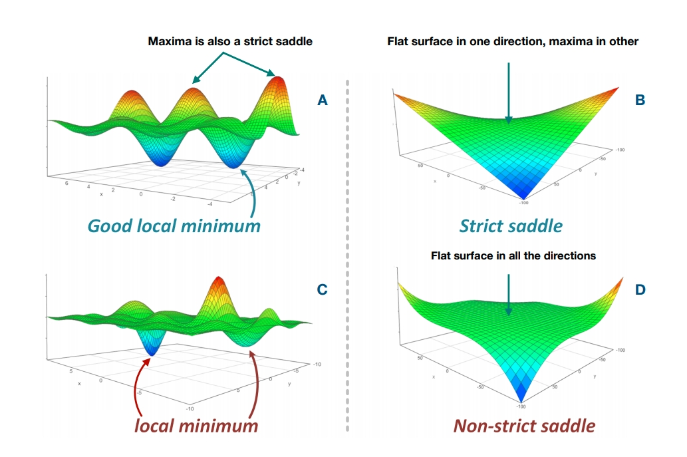

# Problem Statement

In general, an optimization task can be defined as a search process for the maximum output value of a "well behaved" [^1] objective function $f$. Can be defined as $f: \chi \rightarrow \mathbb{R}$ where acceptable solutions $\chi$, has a dimension of $D$, $\chi \subseteq \mathbb{R}^D$ :

[^1]: In this context, it means the function is defined everywhere inside the input domain, it is single-valued and continuous.

```{=tex}
\begin{equation}
\begin{aligned}
& \underset{x}{\text{maximize}}
& & f(x) \\
& \text{subject to}
& & x \subseteq \chi
\end{aligned}
\label{eq:globalopt}
\end{equation}
```

In Figure \@ref(fig:optglobal) we can see some examples where the surface of $f$ could be challenging to be optimized. The surfaces on the left side need careful attention to avoid getting stuck in local optima. Figures on the right side show presence of saddle area, where the gradient of function $f$ is zero, in some cases in only one direction, possibly all directions. In this work, the focus is on the type of objective function $f$, which is challenging to optimize because of the following three difficulties:

-   $f$ is explicitly unknown. This is a typical case in reservoir optimization problems where the Net Present Value (NPV) or Recovery Factor (RF) is computed through solving a vast number of partial differential equations through flow simulation. Thus, a precise analytical expression for the objective function is not available, avoiding the applicability of techniques that exploit the analytical expression of the objective function.
-   The surface of $f$ is multi-modal. Meaning that $f$ is non-convex in the domain of $\chi$ , and the optimization algorithm must visit all local optima to find the "global" one.
-   Most importantly, forward evaluation of $f$ is computationally expensive. This point will be discussed more in detail below.

```{r optglobal, echo=FALSE, fig.cap="This plot may change, it does not show what exactly I want to say...", out.width="70%", fig.align='center'}

```

In the examples of this paper, the goal is to maximize the subsurface-outcomes-based NPV (in USD). Thus, the primary objective function is also referred to as simply NPV in the rest of this paper. This objective function has been widely used in both well control and field development optimization studies. In a deterministic setting, the uncertainty in the geological parameters is disregarded and the optimization is performed based on a single geological model. Therefore, in the case of deterministic optimization, the objective function can be defined as:

```{=tex}
\begin{equation}
J(\mathbf{u, G})= \sum_{k=1}^{K} \Bigg [\sum_{j=1}^{N_p}p_oq_{o,j,k}(\mathbf{u, G}) 
- \sum_{j=1}^{N_p}p_{wp}q_{wp,j,k}(\mathbf{u, G}) - 
\sum_{j=1}^{N_{wi}}p_{wi}q_{wi,j,k}(\mathbf{u, G}) \Bigg]\frac{\Delta t_k}{(1+b)^{\frac{t_k}{D}}}
\label{eq:npvdet}
\end{equation}
```
Where the first term in the double summation corresponds to the oil revenue; the second term is water-production cost and third term corresponds to the water-injection cost. Equation \@ref(eq:npvdet) is considered as objective function in the deterministic setting since only a single geological model is considered. The $G$ in the Equation \@ref(eq:npvdet) is "the geological model". The additional parameters in the Equation are as follows: $K$ is the total number of timesteps; $N_p$ is the total number of production wells subject to optimization; $N_{wi}$ is the total number of water-injection wells subject to optimization; $k$ is the timestep index; $j$ is the well-number index; $p_o$ is the revenue from oil production per unit volume (in USD/bbl); $p_{wp}$ is the water-production cost per unit volume (in USD/bbl); $p_{wi}$ is the water-injection cost per unit volume (in USD/bbl); $q_o$ is the oil-production rate (in B/D); $q_{wp}$ is the water-production rate (in B/D); $q_{wi}$ is the water-injection rate (in B/D); $\Delta t_k$ is the time interval for timestep $k$ (in days); $b$ is the discount rate (dimensionless); $t_k$ is the cumulative time for discounting; and D is the reference time for discounting ($D = 365$ days if b is expressed as a fraction per year and the cash flow is discounted daily). $\mathbf{u}$ in Equation \@ref(eq:npvdet) is the control vector (i.e., a vector of control variables) defined as $\mathbf{u} = [u_1, u_2, \cdots, u_N]^D$, where $D$ is the number of control variables (dimension of optimization problem).

As mentioned above, Equation \@ref(eq:npvdet) lacks to capture the uncertainty in the geological model. In contrast, in a Robust Optimization (RO) setting, the objective is to optimize the expected value over all geological realizations (assumption here is decision maker is risk-neutral). The objective function for the RO setting then can be defined as: (in the case of equiprobable geological realization)

```{=tex}
\begin{equation}
\overline{J}(\mathbf{u}) = \frac{\sum_{re=1}^{n_e} J(\mathbf{u,G_{re}})}{n_e}
\label{eq:npvopt}
\end{equation}
```
Where in Equation \@ref(eq:npvopt) contrary to Equation \@ref(eq:npvdet), there is not one, rather $n_e$ geological realizations, each of them written as $G_{re}$. In this work, the objective is to optimize the Equation \@ref(eq:npvopt), where it is simply EV value of NPV defined in \@ref(eq:npvdet) over all realizations.\

It is well defined in the literature that optimizing Equation \@ref(eq:npvopt) is computationally prohibitive [@debrito2021a; @nwachukwu2018; @hong2017a]. Not only because thousand(s) of PDE have to be solved in the flow-simulation in order to compute the $q_o, q_{wp}, q_{wi}$; the flow simulation must be enumerated over all realizations $n_e$ to compute $\overline{J}(u)$. Let's assume a simple case to illustrate the computational burden of this optimization problem. Assume that an E&P enterprise is in the process of finding the bottom hole pressure of five injection wells and shut-in time of other five production wells, $D=10$. The geology team of the enterprise comes up with 100 geological realizations of the model.($n_e=100$). Now, if we suppose that the reservoir model is 3D with a moderate number of grid cells, it is not hard to imagine that flow-simulation of a fine grid model will take \~1hr. Then, simply having 100 realizations means that each forward computation of $\overline{J}(u)$ takes around \~100 hr. Considering that the enterprise has to decide in 6 month period (in the best case, it can be interpreted as 6 months CPU running time), which means that a total number of the available budget for running the forward model is$\frac{6 \times 30 \times 24 }{100}= 43.2 \approx 50$ is around 50. The budget of only $50$ forward model in ten-dimensional, non-linear, and non-convex optimization problem is relatively low. To put this in simple terms, if we say that each dimension of the control variable $\mathbf{u}$, could be discretized into ten possible cases, then total available solutions for this optimization problem will be $\text {Number of all possible solutions} = 10^{10}$. As it is clear, finding the best solution from a pool of ten billion possible solutions with only 50 shots is a pretty much hard undertaking.\

The rest of this paper will be arguing that the Bayesian Optimization workflow is well suited to deal with the three difficulties described above. Where the workflow needs to capture the optimum global point (area) while having a small forward evaluation budget.
