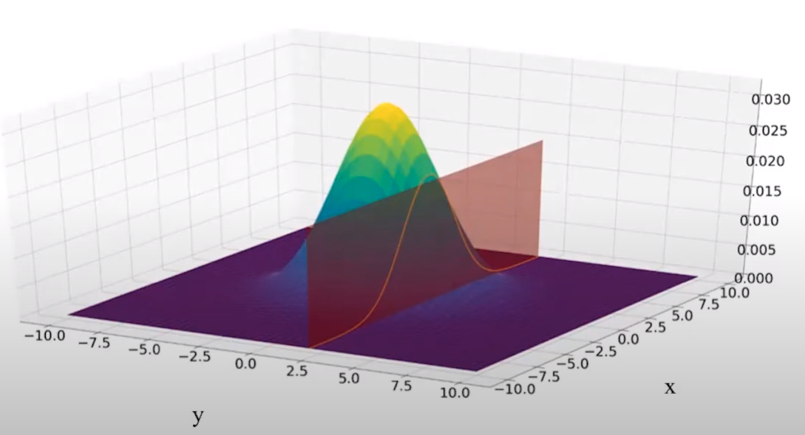

# Bayesian Optimization Workflow

## Overal View

Workflow to perform global optimization of multimodal black-box
functions:

-   Step 1. Choose some initial design points and build a probabilistic
    model over the space of possible objective $f$, this probabilistic
    model serves as prior.

-   Step 2. Combine prior and the likelihood to get a posterior of
    probabilistic model over the objective given some observations.

-   Step 3. Use the posterior to decide where to take the next
    evaluation $\bf{x^*}$ according to some policy for decision making.

-   Step 4. Evaluet the $f$ at $\bf{x^*}$ and augment it to the initial
    data, in step 1.

Iterate between 2 and 4 until the evaluation budget is over. \#\# 3.1
Gaussian Process

\newpage

### Step 1. Probalistic Model as Prior

#### Gaussian Process (GP)

reference to the book [@murphy2022]

Key Assumption in (GP) is that: the function values at a set of $M > 0$
inputs, $\bf{f} = [f(x_1), ...,f(x_M)]$, is jointly Gaussian, with mean
and Covariance

```{=tex}
\begin{equation}
(\mu = m(x_1),...m(x_M))
\sum_{i,j}= \kappa(x_i,x_j)
\label{eq:mean_cov}
\end{equation}
```

and $\kappa$ is a positive definite (Mercer) kernel. Suppose we have a
initial design points, set $\mathcal{D} = {(x_n, y_n) : n = 1 : N}$,
where $y_n = f(x_n)$ is the noise-free observation of the function
evaluated at $x$.

Now we consider the case of predicting the outputs for new inputs that
may not be in $\mathcal{D}$.
<!-- Specifically, given a test set of size $N_∗×D$, we want to predict the function outputs $\bf{f_∗} = [f(x_1), . . . , f(x_{N_*})]$. -->

```{=tex}
\begin{equation}
\bf{f_{*}} = [f(x_1),.., f(x_{N_{*}})]
\label{eq:pred_fun}
\end{equation}
```
By definition of the GP, the joint distribution $p(\bf{f_X},f|X,X_*)$
has the following form:

```{=tex}
\begin{equation}
\begin{bmatrix}  {\bf {f}_X}  \\  {{\bf f}_*} \end{bmatrix} \sim\mathcal{N} \begin{pmatrix} (\begin{bmatrix}  {{\bf \mu}_X}  \\  {{\bf \mu}_*} \end{bmatrix}),\begin{bmatrix} {{\bf K}_{X,X}}  & {{\bf
K}_{X,*}}  \\  {{\bf \mathbf{K}^\intercal}_{X,*}} & {{\bf K}_{*,*} } \end{bmatrix}\end{pmatrix}
\label{eq:gp_model}
\end{equation}
```
```{=tex}
\begin{equation}
  \begin{split}
\mu_X = [m(x_1),...,m(x_N)] \\ 
\mu^\ast = [m(x^\ast_1,...m(x^\ast_N))]
  \end{split}
\label{eq:mu_val}
\end{equation}
```
```{=tex}
\begin{equation}
 \begin{split}
K_{X,X} = {\Large \kappa} (X,X; \theta) , \; \; \; \; \; \ size (N \times  N) \\
K_{X,\ast} = {\Large \kappa} (X,X_\ast; \theta), \; \; \; \; \; \ size (N \times N_*) \\
K_{\ast,\ast} = {\Large \kappa} (X_\ast, X_\ast; \theta), \; \; \; \; \; \ size(N_\ast \times N_\ast)
 \end{split}
\label{eq:cov_sign}
\end{equation}
```

```{r, echo=FALSE, message=FALSE, error=FALSE, eval=TRUE, fig.align='center'}
library(tidyverse)
library(kableExtra)
df <- data.frame(key = c("Gaussain", 
                         "Matern $\\mu=\\frac{5}{2}$", 
                         "Matern $\\mu=\\frac{3}{2}$",
                         "Exponetial",
                         "Power-Exponetial"), 
                 equation = c("$\\Large \\kappa (x,x') =\\sigma_f^2 exp(-\\frac{h^2}{2\\ell^2})$",
"$\\Large \\kappa (x,x') =\\sigma_f^2(1 + \\frac{\\sqrt{5}|h|}{\\ell}\\frac{5h^2}{3\\ell^2})exp(-\\frac{ -\\sqrt{5}|h|}{\\ell})$",
"$\\Large \\kappa (x,x') =\\sigma_f^2(1 + \\frac{\\sqrt{3}|h|}{\\ell})exp(-\\frac{-\\sqrt{3}|h|}{\\ell})$",
"$\\Large \\kappa (x,x') =\\sigma_f^2 exp(-\\frac{|h|}{\\ell})$",
"$\\Large \\kappa (x,x') =\\sigma_f^2 exp(-(\\frac{|h|}{\\ell})^p)$"
))

colnames(df) <- c("Covariance Kernels","assumeing $h=||x-x'||$")
#df %>%  knitr::kable(format = "html", escape = FALSE )
#knitr::kable(df, escape = FALSE, format = "latex", align = "c")
#df %>%  kableExtra::kable(format = "latex", escape = FALSE) %>% 
#    kable_styling()
#  row_spec(2, background = "green")

kbl(df, booktabs = T,escape = FALSE, format = "latex") %>%
  kable_styling(position = "center", latex_options = "HOLD_position", full_width = T)
```

```{=tex}
\begin{equation}
{\Large \kappa} (x,x'; ;\theta) = (1 + \frac{\sqrt{5}|h|}{\theta} + \frac{5h^2}{3\theta^2})exp(-\frac{-\sqrt{5}|h|}{\theta}
\label{eq:pred_fun1}
\end{equation}
```

#### Covariance Kernel, Parameter estimation

```{=tex}
\begin{equation}
p(y|\bf{X,\theta}) = \int p(y|\bf{f,X})p(f|\bf{X,\theta})
\label{eq:lig_int}
\end{equation}
```

```{=tex}
\begin{equation}
\text{log} p(y|\bf{X,\theta})=\mathcal{L}(\zeta,\sigma_f^2)=-\frac{1}{2}(y-\mu_X)^{\intercal}\mathbf{K}_{X,X}^{-1}(y-\mu_X)-\frac{1}{2}log|K_{X,X}|-\frac{n}{2}log(2\pi)
\label{eq:log_like}
\end{equation}
```

Where the dependence of the $\bf{K}_{X,X}$ on $\theta$ is implicit.The
gradient-based optimizer is performed in order to:

```{=tex}
\begin{equation}
[\zeta^\ast, \sigma_f^{2\ast}]=argmax\mathcal{L}(\zeta,\sigma^2_f)
\label{eq:log_like_opt}
\end{equation}
```

However, since the objective $\mathcal{L}$ is not convex, local minima
can be a problem, so we may need to use multiple restarts.

### Step 2. Posterior of Probabilistic Model

#### Posterior of Gaussain Process, (conditioning on initial data)

Here in \@ref(fig:gaus-norm)


```{r gaus-norm, echo=FALSE, fig.align='center', out.width="400px", out.height="100px", fig.retina=2, fig.cap="proof of"}

```


```{=tex}
\begin{equation}
p(f_\ast|X_\ast,\mathcal{D}) = \mathcal{N}(f_\ast|{{\bf \mu}_\ast} , \scriptsize{\sum}_{\ast}\normalsize)
\label{eq:post_proba}
\end{equation}
```

```{=tex}
\begin{equation}
  \begin{split}
{{\bf \mu}_\ast}=m(\bf X_\ast) +{\bf \mathbf{K}^\intercal}_{X,*}{\bf \mathbf{K}^{-1}}_{X,X}(f_X-m(X)) \\
\scriptsize{\sum}_{\ast}=\normalsize{\mathbf{K}_{\ast,\ast}-\mathbf{K}^\intercal_{X,\ast}\mathbf{K}_{X,X}^{-1}\mathbf{K}_{X,\ast}}
  \end{split}
\label{eq:post_mean_cov}
\end{equation}
```

### Example of Step.1 and Step.2

```{r, echo=FALSE, message=FALSE, error=FALSE}
library(plgp)
library(mvtnorm)
plot_multivariate_gauss <- function(vector_of_x,eps) {
  
  X <- matrix(vector_of_x,ncol = 1)
  y <- sin(X)
  D <- distance(X) 
  Sigma <- exp(-D) + diag(eps, ncol(D))

  XX <- matrix(seq(-0.5, 2*pi + 0.5, length=100), ncol=1)
  DXX <- distance(XX)
  SXX <- exp(-DXX) + diag(eps, ncol(DXX))
  
  DX <- distance(XX, X)
  SX <- exp(-DX) 
  
  Si <- solve(Sigma)
  mup <- SX %*% Si %*% y
  Sigmap <- SXX - SX %*% Si %*% t(SX)
  
  YY <- rmvnorm(100, mup, Sigmap)
  
  q1 <- mup + qnorm(0.05, 0, sqrt(diag(Sigmap)))
  q2 <- mup + qnorm(0.95, 0, sqrt(diag(Sigmap)))
  
  matplot(XX, t(YY), type="l", col="gray", lty=1, xlab="x", ylab="y", 
          main="Gaussian Process Regression")
  points(X, y, pch=20, cex=2)
  lines(XX, sin(XX), col="blue")
  lines(XX, mup, lwd=2)
  lines(XX, q1, lwd=2, lty=2, col=2)
  lines(XX, q2, lwd=2, lty=2, col=2)
  legend("topright", legend=c("A Sample", "True function", "90% CI", "90% CI", "Training Data"),
         col=c("gray", "blue", "red","red","black"),lty=c(1,1,2,2,NA),
         pch = c(NA, NA,NA,NA,20),
         cex=0.8, box.col = "white",bg = "white", ncol = 2)
}
```

Assume $X=[0,3,5,6]$ and $f_X=sin(X)$, giving $\mathcal{D}=(X,f_X)$.
What is $p(f_\ast|X_\ast,\mathcal{D})$

```{r guass-1, echo=FALSE, fig.retina=2, out.width="100%", fig.cap="Gaussin Process Regression conditioned on 4 points"}
plot_multivariate_gauss(c(0,3,5,6), 10^-6)
```

Now we sample the point $X=1$, and add to $\mathcal{D}$

```{r guass-2, echo=FALSE, fig.retina=2, out.width="100%", out.height="50%",fig.cap= "Gaussin Process Regression conditioned on 5 points", fig.align='center'}
plot_multivariate_gauss(c(0,1,3,5,6), 10^-6)
```

### Step.3 Deciding on next $\bf{x}^\ast$ based on Posterior

Posterior of the probalistic model quantify the uncertainty over the
space of the $f$. The question is what is the next $\bf{x}^\ast$ to be
sampled from the *expensive function*?

Define an utility function to collect new data points satisfying some
optimality criterion: optimization as decision making.

There are a few of policies in the literature of Bayesopt, here the
*Expected Improvement (EI)* policy will be used.

#### Expected Improvement as Policy for Decision Making

In Expected Improvement (EI) policy choose the next query point as the
one which has the highest expected improvement over the space of the
*expensive function*

```{=tex}
\begin{equation}
utility(x;\theta,\mathcal{D})=\alpha_{EI}=\int_{y}^{}max(0,y-f)p(y|x;\theta,\mathcal{D})
\label{eq:uti_int}
\end{equation}
```
$$utility(x;\theta,\mathcal{D})=\alpha_{EI}=\int_{y}^{}max(0,y-f)p(y|x;\theta,\mathcal{D}) \,dy$$

However, we do not have access to the *expensive function*, $f$,
therefore we replace the $f$ with the best available solution found so
far, $y^+$

```{=tex}
\begin{equation}
utility(x;\theta,\mathcal{D})=\alpha_{EI}=\int_{y}^{}max(0,y-y^{\dagger})p(y|x;\theta,\mathcal{D}) \,dy
\label{eq:uti_int_2}
\end{equation}
```
$y^{+}$ : The best solution found in the training dataset $\mathcal{D}$

The good news: The analytical form of the utility function is available
for the gaussian process

```{=tex}
\begin{equation}
\gamma(\mathbf{x})=\frac{\mu(\mathbf{x;\theta,\mathcal{D}})-y^{\dagger}}{\sigma(\mathbf{x;\theta,\mathcal{D}})}
\label{eq:uti_int_gamma}
\end{equation}
```
```{=tex}
\begin{equation}
utility(\mathbf{x};\theta,\mathcal{D})=\alpha_{EI}(x;\theta,\mathcal{D})=(\mu(x;\theta,\mathcal{D})-y^{\dagger})\Phi(\gamma(x)) + \sigma(x;\theta,\mathcal{D})\phi(\gamma(x))
\label{eq:uti_int2}
\end{equation}
```

Where $\Phi(.)$ and $\phi(.)$ are CDF and PDF of standard Gaussian
distribution.

It is too greedy in the context of the sequential decision making.
Therefore, an explorative term is added as explorative" parameter
$\epsilon$.

```{=tex}
\begin{equation}
\gamma(\mathbf{x})=\frac{\mu(\mathbf{x;\theta,\mathcal{D}})-y^{\dagger}-\epsilon}{\sigma(\mathbf{x;\theta,\mathcal{D}})}
\label{eq:uti_greed_gamma}
\end{equation}
```
```{=tex}
\begin{equation}
\alpha_{EI}(x;\theta,\mathcal{D})=(\mu(x;\theta,\mathcal{D})-y^{\dagger}-\epsilon)\Phi(\gamma(x)) + \sigma(x;\theta,\mathcal{D})\phi(\gamma(x))
\label{eq:uti_int_gred2}
\end{equation}
```

#### BO As a "mapping" between two problems

BO is an strategy to transform the problem

```{=tex}
\begin{equation}
u_M = \underset{u\in \text{constraints}}{\mathrm{argmax}}\overline{J}(u)
\label{eq:exp_eq}
\end{equation}
```

unsolvabale!

```{=tex}
\begin{equation}
u^{next}=\underset{u\in \text{constraints}}{\mathrm{argmax}} \alpha_{EI}(u;\mathcal{D}_n, \theta^\ast)
\label{eq:exp-easy}
\end{equation}
```

solvabale!

+ $\alpha_{EI}(u)$ is inexpensive to evaluate.
+ The analytical expression for gradient of $\alpha_{EI}(u)$ is
    available.
+ Still need to find $u^{next}$, the multi-start BFGS is used for
    finding $u^{next}$.
