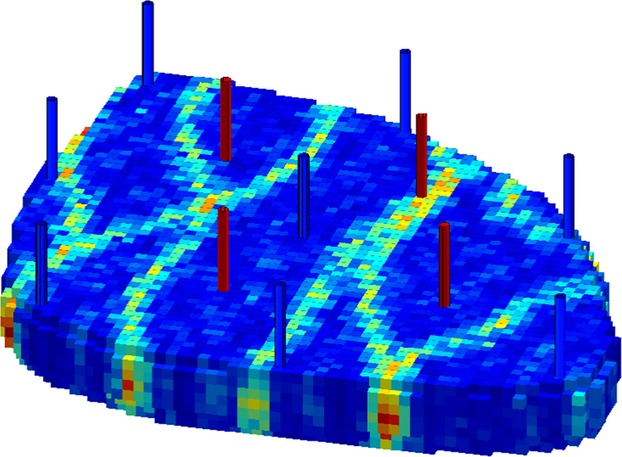

# Case II: Field Scale Problem

This section applies the BO workflow to a synthetic 3D reservoir model to optimize field production by controlling the water flooding scheme. The synthetic 3D model, known as the "Egg Model", has a geology of channelized depositional system. One hundred equiprobable geological realizations describe the highly permeable channels, three of which are illustrated on the left side of Figure \@ref(fig:combine).[@hong2017]. The 3D model has eight water injectors, and four producers have shown in Figure \@ref(fig:eggbase). A thorough introduction of the model and its geological description can be found in [@jansen2014].

Relative permeabilities and the associated fractional flow curve of the reservoir model are shown on the right side of Figure \@ref(fig:combine). All the wells are vertical and completed in all seven layers. The reservoir rock is assumed to be incompressible. The production from the reservoir has a life-cycle of 10 years, as suggested in [@jansen2014]. Here, the injection rate to be maintained over the reservoir's life cycle will be optimized. Given the objective function and uncertainty in the geological model, the optimization problem can be defined: whats is the optimum water injection rate for eight injector wells for the whole ten-year period of reservoir production. However, the optimization is not unbounded, and water injection per well can be adjusted from 5 to 100 m3/day, imposing a box-constrain on the optimization problem. The injectors are operated with no pressure constraint, and the producers are under a minimal BHP of 395 bars without rate constraint.

```{r combine, echo=FALSE,out.width="100%",fig.show='hold', fig.align='center', fig.cap="Left: Three geological realizations of the 3D model; Right: Rel perm and fractional flow curve, Hong et al., 2017, Jansen et al., 2014",cache=TRUE}
knitr::include_graphics(c("img/combine.jpg"))
```

```{r eggbase, echo=FALSE, fig.align='center', out.width="300px", fig.retina=2, fig.cap="Well locations in Egg model, blue ones are injection, the red producers, Jansen et al., 2014", cache=TRUE}

```
## Well-Control Optimization

Revisiting the equations raised in section \@ref(problem-statement), we assume that the geological uncertainty ($\mathbf{G}$) can be represented by sampling its pdf to obtain an ensemble of $N_e$ realizations, $\mathbf{G}_i$, $i=1,2,\cdots,n_e$. Then, approximating the expectation of $\mathbf{J}$ with respect to $\mathbf{G}$ can be shown as:

```{=tex}
\begin{equation}
\mathbf{\overline{J}(u)} = \frac{\sum_{i=1}^{n_e} \mathbf{J}(\mathbf{u},\mathbf{G}_i)}{n_e} 
\label{eq:npvoptrep}
\end{equation}
```

$\mathbf{u}$ is 1-d vector with a dimension of eight, where each element contains injection rate for each injection well. Therefore the decision (control) vector, to be optimized in this case, is defined as:

```{=tex}
\begin{equation}
\mathbf{u}=[u_{inj1},u_{inj2},u_{inj3},u_{inj4},u_{inj5},u_{inj6},u_{inj7},u_{inj8}]^{\intercal} 
\label{eq:cont-vec}
\end{equation}
```

As Equation \@ref(eq:npvoptrep) suggests, the $\mathbf{\overline{J}(u)}$ needs some parameters to be defined. These economical parameters, oil price ($P_o$), water production cost ($p_{wp}$), and water injection cost ($P_{wi}$) in a unit of $\$/m^3$ have been provided in Table \@ref(tab:npvparam). The cash flow is discounted daily and the discount factor is available in Table \@ref(tab:npvparam). We want to note that in this work, to avoid further computational burden in the optimization process, ten realizations of the "Egg model" have been considered, therefore $n_e=10$ in Equation \@ref(eq:npvoptrep).

The calculation procedure for $\mathbf{\overline{J}(u)}$ is as follows: first, we decide on the $\mathbf{u}$ and write that in the *DATA* file as input to the reservoir simulator. Then we run the file in the numerical reservoir simulators [@rasmussen2021] given that the production life of the reservoir is ten years. We repeat the simulation for all geological realizations $\mathbf{G}_i$, $i=1,2,\cdots,n_e$. Then, we have oil production $(q_o)$, water production $(q_{wp})$, and water injection $(q_{wi})$ as the output of the simulator per day. Then, we can insert $q_o$, $q_{wp}$, $q_{wi}$ and values in Table \@ref(tab:npvparam) into Equation \@ref(eq:npvoptrep) to get $\mathbf{\overline{J}(u)}$.

```{r, warning=FALSE, message=FALSE, cache=TRUE, echo=FALSE}

bo_12345 <- readRDS("processed_data/bo_12345_401000.Rds")
#
bo_1234 <- readRDS("processed_data/bo_1234_401000.Rds")
#
bo_123 <- readRDS("processed_data/bo_123_401000.Rds")

```

```{r, echo=FALSE, warning=FALSE, message=FALSE}

library(latex2exp)
library(patchwork)
library(gridExtra)
library(tidyverse)
library(kableExtra)

```

```{r npvparam, echo=FALSE}
price_data <- tibble(item_1=c("P_o","P_wp","P_wi"),
                     price=c("315","47.5","12.5"),
                     item_2=c("b","D","n_e"),
                     price2=c("8%","365","10"))

colnames(price_data) <- c("Item","Price", "Items", "Value")
#price_data %>%  kableExtra::kable(format = "html", escape = FALSE) %>%
#    kable_styling()
kbl(price_data, format = "latex", caption = "Required Parameters needed for calculation of Expected NPV")%>%
  kable_styling(position = "center", latex_options = "HOLD_position", full_width = T)
```

## BO Workflow

As discussed, the BO workflow's starting point is to randomly sample a finite number of $\mathbf{u_i}$ from the space of the control variable. These random samples with their correspondent function values form $\mathcal{D}=[\mathbf{U},\mathbf{J(U)}]$. This $\mathcal{D}$ is used to build the probabilistic model (GPR model) of the response surface ($\mathbf{J(U)}$) to the input variables($\mathbf{U}$). In this work, forty samples from the Latin Hyper Cube Sampling (LHS) method were drawn. Note that we draw forty samples $\mathbf{u}_i$, $i=1:40$ while each $\mathbf{u}_i$ is a 1-d vector of dimension eight and each of these eight values can only take a value between 5 to 100 (constraints). The LHS is preferred in this work to Monte Carlo since it provides the stratification of the CDF of each variable, leading to better coverage of the input variable space. The Figure \@ref(fig:lhssampling) shows the results of $\mathbf{\overline{J}(u_i)}$ for each sample from LHS. Also, The maximum $\mathbf{\overline{J}(u_i)}$ found from random sampling has been shown with a blue line. Setting the specific seed number (since LHS is a random process), we get the maximum expected $NPV$ achieved here is $35.65 \$MM$. Looking at Figure \@ref(fig:lhssampling) it is worth mentioning that random sampling like the LHS is not helpful to consistently approach the global optimum point, as the solution does not improve with additional sampling. There is a need for an efficient workflow to find the optimum point while using a few as possible evaluations of objective function given in \@ref(eq:npvoptrep).

```{r lhssampling, echo=FALSE, fig.retina=2, fig.align='center', fig.cap="Expected NPV as result of forty sampling from LHS"}
bo_123$scoreSummary[1:40,] %>% 
  arrange(Score) %>% 
  ggplot(aes(Iteration, Score)) +
  geom_point(colour = "blue", size = 3)+
  xlab("Sample Number") + ylab("Expected NPV (in $MM)") +
  scale_x_continuous(limits = c(1, 40),breaks = seq(0,40,2))+
  scale_y_continuous(limits = c(28, 38),breaks = seq(28,38)) +
  geom_hline(aes(yintercept = max(bo_123$scoreSummary[1:40,]$Score))) +
  geom_text(aes(5, max(bo_123$scoreSummary[1:40,]$Score), 
                label = "Maximum Point in LHS", vjust = - 1, fontface="italic"), fontface="italic", size=4, data = data.frame()) +
  labs(x = TeX("Number of Samples, $# \\bar{J}(u)$"))
```

Having the initial data ($\mathcal{D}$) found through LHS, we can build the probabilistic model, representing our understanding of objective function surface. Unfortunately, in this section, we can not plot the posterior of the probabilistic model, conditioned on the above forty LHS samples, because the input space is eight-dimensional and hard to visualize. We can refer to the Figure \@ref(fig:exampleshow) (in 1-D Toy Problem section) to get the idea of the plot of the probabilistic model conditioned to the $\mathcal{D}$. For the mathematical expression of the posterior model, it can be referred to Equation \@ref(eq:post-mean-cov-single). Then, after we have the posterior model, we need to perform optimization in Equation \@ref(eq:exp-easy) to find the next $\mathbf{u^{next}}$. This process continues sequentially, where first we have initial samples $\mathcal{D}$, then we find new pair $\mathbf{u}^{next},\mathbf{J(u^{next})}$. Then this new pair is added back to the initial $\mathcal{D}$ and new iteration starts with new $\mathcal{D}=\mathcal{D}\: \cup[\mathbf{u}^{next},\mathbf{J(u^{next})}]$. Figure \@ref(fig:lhsbayesop) shows the expected NPV found after ten sequential iteration resulted from the BO workflow. Readers are referred to this point that, not all red points are increasing in the figure and some points are lower than previous points. The reason for this behavior is the nature of the BO algorithm. We can suggest that in the points with lower expected NPV than the previous, we may reach the lower point, but those points helped us to decrease the uncertainty ("We learn") which is helpful for further iteration. We can see that after just ten evaluations of the expensive function (here it means finding the expected NPV from running ten geological realizations using flow simulation) we reach the new record expected NPV of $max \overline{J}(u)=36.85$$\$MM$.

```{r lhsbayesop, echo=FALSE, fig.retina=2, fig.align='center', fig.cap="Blue points represnts the sample from LHS, red points represents the samples from the BayesOpt Workflow"}
opt_type <- c(rep("LHS Sampling",40),rep("Bayesian Opt",10))

bo_123$scoreSummary[1:50,] %>% 
  add_column(Sampling_Scheme = opt_type) %>% 
  ggplot(aes(Iteration, Score, colour = Sampling_Scheme)) +
  geom_point(size = 3)+
  labs(x = TeX("Number of Samples, $# \\bar{J}(u)$")) +
  ylab("Expected NPV (in $MM)") +
  scale_x_continuous(limits = c(1, 50),breaks = seq(0,50,5))+
  scale_y_continuous(limits = c(28, 37),breaks = seq(28,37)) +
  scale_color_manual(values = c("red", "blue")) +
  geom_hline(aes(yintercept = max(bo_123$scoreSummary[1:40,]$Score)), alpha=0.4, 
             linetype = "dashed") +
  annotate("text", x=10, y=max(bo_123$scoreSummary[1:40,]$Score), 
           label=("Maximum Point in LHS"), size=4, color="blue", vjust = - 1, fontface="italic") +
  geom_hline(aes(yintercept = max(bo_123$scoreSummary[1:50,]$Score)), alpha=0.4, 
             linetype = "dashed") +
  annotate("text", x=30, y=max(bo_123$scoreSummary[1:50,]$Score), 
           label=("Maximum Point in BayesOpt"), size=4, color="red", vjust = - 1, fontface="italic") +
  theme(legend.position = "none")
```

As we explained in 1-D Toy Problem, the plot of the utility of the next point $\alpha_{EI}(\mathbf{u}^{next};\theta^*, \mathcal{D})$ at each iteration could provide some useful information about the optimization process. The Figure \@ref(fig:utilitycurve) plots the $\alpha_{EI}(\mathbf{u}^{next};\theta^*, \mathcal{D})$, Equation \@ref(eq:exp-easy) along the ten iterations in this work. In fact, the notation $\alpha_{EI}(\mathbf{u}^{next};\theta^*, \mathcal{D})$ means the optimum of the $\alpha_{EI}(\mathbf{u_*};\mathcal{D},\theta^*)$ after running multi-start (1000)- L-BFGS-B. Now, we can see that in the Figure, $\alpha_{EI}(\mathbf{u}^{next};\theta^*, \mathcal{D})$ is decreasing going toward zero. It can be inferred from this trend that, we are going out of the *good* $\mathbf{u}^{next}$ values to be fed into the expensive function, as they are low in utility. Perhaps it can be interpreted that we are in the vicinity of global optima, if we see after several iterations still $\alpha_{EI}(\mathbf{u}^{next};\theta^*, \mathcal{D})$ is less than $10^-6$.

```{r utilitycurve, echo=FALSE,fig.retina=2, fig.align='center', fig.cap="Maximum utility at each iteration, after running L-BFGS-B to find the u with max utility, $\\alpha_{EI}^*$"}
bo_123$scoreSummary %>% 
  filter(acqOptimum == TRUE) %>% 
  ggplot(aes(Epoch, gpUtility)) +
  geom_point(size=3, color="yellow", shape=23, fill="firebrick") +
  geom_line(linetype="dashed") +
  scale_x_continuous(limits = c(1, 10),breaks = seq(1,10,1)) +
  xlab("Iteration") +
  labs(y = TeX("Maximum Utility at each iteration, $\\alpha_{EI}^*(\\mathbf{u}^{next}; \\theta^*, D)$"))
```

Given that the BO has stochastic nature (meaning that having different initialization in LHS sampling will affect the final solution), BO is repeated with three different initializations. Ideally, these repetitions need to be conducted 100 or 1000 times to understand the algorithm's stability to different initialization. However, because of the computational burden, in this work, only three repetitions were performed. Figure \@ref(fig:difinit) shows results of three repetitions (top, middle, bottom), where each blue points in the plot has its own specific seed number for random generation at LHS process. Then, given that initialization $\mathcal{D}$, the sequential finding of $\mathbf{u}^{next}$ is performed, shown in the red points. Like the previous case, in each repetition, forty samples are drawn from LHS, the ten were taken through iterations in BO, leaving $\mathcal{D}$ with fifty pairs of $\mathbf{u},\mathbf{J(u)}$ . At each row of Figure \@ref(fig:difinit), two horizontal lines show the maximum point $\mathbf{\overline{J}(u)}$ in both random sampling phase (LHS) and (BO) phase. As it can be noted from Figure \@ref(fig:difinit), at each repetition, the BO will improve the solution with a small sample evaluation of the $\mathbf{\overline{J}(u)}$. Therefore, improvement following the BO phase is independent of the initial design, and reasonably we can conclude that randomness in initialization will not degrade the performance of workflow.

Nevertheless, the bigger question is whether, given a different initial design, does the algorithm converges the vicinity of a global optimum? What is meant here is that if having different initialization will lead completely different final solution, that hints that the algorithm has a "local" search. In contrast, if the solutions lead to one specific close $\mathbf{u}$, that represents that algorithm has a "global" view on the surface of the objective function. In the case of "global" optimization having different initialization should lead to a similar final solution. In that case, the algorithm will not get stuck in the local optimum point. 

<!-- This is common practice in gradient-based optimization, where the algorithm is powerful in local optimization and in order to avoid being stuck in local extreme points, "multi-start" runs are performed to search the global point in the objective function. -->

```{r difinit,fig.retina=2, echo=FALSE,fig.align='center', out.height="90%", out.width="90%", fig.cap="BayesOpt workflow applied to Syntetic 3D model, in three different initialization", message=FALSE, error=FALSE, warning=FALSE}

opt_type <- c(rep("LHS Sampling",40),rep("Bayesian Opt",10))

plot_bo_123 <- bo_123$scoreSummary[1:50,] %>% 
  add_column(Sampling_Scheme = opt_type) %>% 
  ggplot(aes(Iteration, Score, colour = Sampling_Scheme)) +
  geom_point(size = 2)+
  labs(x = TeX("Number of Samples, $# \\bar{J}(u)$")) + ylab("Expected NPV (in $MM)") +
  scale_x_continuous(limits = c(1, 50),breaks = seq(0,50,5))+
  scale_y_continuous(limits = c(28, 38),breaks = seq(28,38)) +
  scale_color_manual(values = c("red", "blue")) +
  geom_hline(aes(yintercept = max(bo_123$scoreSummary[1:40,]$Score)), alpha=0.4, linetype = "dashed") +
  annotate("text", x=15, y=max(bo_123$scoreSummary[1:40,]$Score), 
           label=("Maximum Point in LHS"), size=2, color="blue", vjust = - 1, fontface="italic") +
  geom_hline(aes(yintercept = max(bo_123$scoreSummary[1:50,]$Score)), alpha=0.4, linetype = "dashed") +
  
  annotate("text", x=30, y=max(bo_123$scoreSummary[1:50,]$Score), 
           label=("Maximum Point in BayesOpt"), size=2, color="red", vjust = - 1, fontface="italic") +
  
  theme(legend.position = "none") +
  theme(axis.text = element_text(size = 6)) +
  theme(axis.title = element_text(size = 6))


plot_bo_1234 <- bo_1234$scoreSummary[1:50,] %>% 
  add_column(Sampling_Scheme = opt_type) %>% 
  ggplot(aes(Iteration, Score, colour = Sampling_Scheme)) +
  geom_point(size = 2)+
  labs(x = TeX("Number of Samples, $# \\bar{J}(u)$")) + ylab("Expected NPV (in $MM)") +
  scale_x_continuous(limits = c(1, 50),breaks = seq(0,50,5))+
  scale_y_continuous(limits = c(28, 38),breaks = seq(28,38)) +
  scale_color_manual(values = c("red", "blue")) +
  geom_hline(aes(yintercept = max(bo_1234$scoreSummary[1:40,]$Score)), alpha=0.4, linetype = "dashed") +
  
  annotate("text", x=15, y=max(bo_1234$scoreSummary[1:40,]$Score), 
           label=("Maximum Point in LHS"), size=2, color="blue", vjust = - 1, fontface="italic") +
  
  geom_hline(aes(yintercept = max(bo_1234$scoreSummary[1:50,]$Score)), alpha=0.4, linetype = "dashed") + 
  annotate("text", x=30, y=max(bo_1234$scoreSummary[1:50,]$Score), 
           label=("Maximum Point in BayesOpt"), size=2, color="red", vjust = - 1, fontface="italic") +  
  
  theme(legend.position = "none") + 
  theme(axis.text = element_text(size = 6)) +
  theme(axis.title = element_text(size = 6)) # change axis titles


plot_bo_12345 <- bo_12345$scoreSummary[1:50,] %>% 
  add_column(Sampling_Scheme = opt_type) %>% 
  ggplot(aes(Iteration, Score, colour = Sampling_Scheme)) +
  geom_point(size = 2)+
  labs(x = TeX("Number of Samples, $# \\bar{J}(u)$")) + ylab("Expected NPV (in $MM)") +
  scale_x_continuous(limits = c(1, 50),breaks = seq(0,50,5))+
  scale_y_continuous(limits = c(28, 38),breaks = seq(28,38)) +
  scale_color_manual(values = c("red", "blue")) +
  geom_hline(aes(yintercept = max(bo_12345$scoreSummary[1:40,]$Score)), alpha=0.4, 
             linetype = "dashed") +
  
  annotate("text", x=15, y=max(bo_12345$scoreSummary[1:40,]$Score), 
           label=("Maximum Point in LHS"), size=2, color="blue", vjust = - 1, fontface="italic") +
  geom_hline(aes(yintercept = max(bo_12345$scoreSummary[1:50,]$Score)), alpha=0.4, 
             linetype = "dashed") +
  annotate("text", x=30, y=max(bo_12345$scoreSummary[1:50,]$Score), 
           label=("Maximum Point in BayesOpt"), size=2, color="red", vjust = - 1, fontface="italic") +  
  theme(legend.position = "none") +
  theme(axis.text = element_text(size = 6)) +
  theme(axis.title = element_text(size = 6))

grid.arrange(plot_bo_123, plot_bo_12345, plot_bo_1234, ncol=1)

```

The left side of Figure \@ref(fig:diffu) shows the effect of initialization on the final solution, $\mathbf{u}^{best}$ value for each repetition. Where the $\mathbf{u}^{best}$ is a vector of 8 dimensions, each value shows the optimum injection rate for the ten-year life cycle of the field, in $m^3/D$. We want to note that the y axis was plotted from the range of 5 to 100. This range is consistent with the constrain of the optimization problem, where the injection rate for each well can take any number between $5\:m^3/D$ to $100\:m^3/D$. Visually, looking in the left plot at Figure \@ref(fig:diffu), we can see that the final solution of three repetitions at each well, does not differ significantly. With a small exception of (injection \#2), it seems all the final solutions converge to the same solution. This feature that can be loosely said as "robustness" of optimization workflow to initial design is beneficial. We do not need to restart the optimization with different initialization since they all will converge to a similar solution. From this perspective, authors can hint that BO workflow can be considered a "global" optimization method. It shows that the workflow avoids being stuck in local extreme points or saddle regions. The plot on the right side of Figure \@ref(fig:diffu) shows the mean injection rate (mean of three repetitions) and error bar at each injection wells. The bottom of the error bar in this plot shows the $mean-sd$ and top of bar is $mean + sd$ . As we can see that we do not see significant variation in the final solution in each repetition. Also, the plots recommend that repeating the optimization more than three times (like 10 or 100) can lead to lower variation in the final solution.

```{r diffu, echo=FALSE, fig.retina=2, fig.align='center', out.width="90%", fig.cap="Left: final solution of optimization algorithm in three different initialization, Right: Mean and error bar of each injection rate at each injection wells"}

##############
library(ParBayesianOptimization)
u_best_123 <- getBestPars(bo_123)
u_best_1234 <- getBestPars(bo_1234)
u_best_12345 <- getBestPars(bo_12345)

###########

list_best_u <- list(u_best_123,u_best_1234,u_best_12345)
df_list_best_u <- data.frame(matrix(unlist(list_best_u), byrow = F, nrow = 8))
df_list_best_u$inj <- c("Inj1","Inj2","Inj3","Inj4","Inj5","Inj6","Inj7","Inj8")
df_list_best_longer <- df_list_best_u %>% 
  pivot_longer(-inj,names_to = "Replication", values_to = "Injection_Rate")


###########

p1 <- ggplot(data=df_list_best_longer, aes(x=inj, y=Injection_Rate, fill=Replication)) +
geom_bar(width = 0.4, stat="identity", position=position_dodge()) +
  coord_cartesian(ylim = c(5, 100)) +
  scale_color_manual(labels = c("Random LHS #1", "Random LHS #2", "Random LHS #3"),
                     values = c("red", "blue", "green"),
                     aesthetics = "fill") +
  theme(legend.position = "top") +
  theme(legend.title = element_text(colour="black", size=7, 
                                      face="bold")) +
   theme(legend.text = element_text(size=6)) +
   theme(legend.key.size = unit(0.2, 'cm')) +
  labs(y = TeX("Injection Rate, $m^3/D$"))


df_new <- df_list_best_longer %>% 
  group_by(inj) %>%
  mutate(upper = mean(Injection_Rate) + sd(Injection_Rate), 
         lower = mean(Injection_Rate) - sd(Injection_Rate))


p2 <- ggplot(df_new, aes(x = inj, y = Injection_Rate)) +
  stat_summary(fun = mean, geom = "bar", position = position_dodge(width = .9),size = 3) + 
  geom_errorbar(aes(ymin = lower, ymax = upper),
                width = .2,                    # Width of the error bars
                position = position_dodge(.9),
                color='#E69F00') +
  coord_cartesian(ylim = c(5, 100)) +
  labs(y = TeX("Injection Rate, $m^3/D$"))

p1+p2
```
